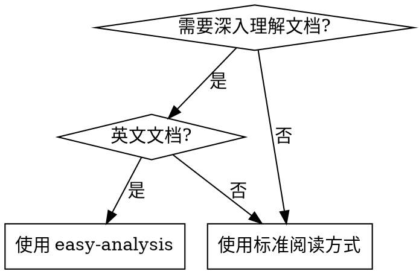
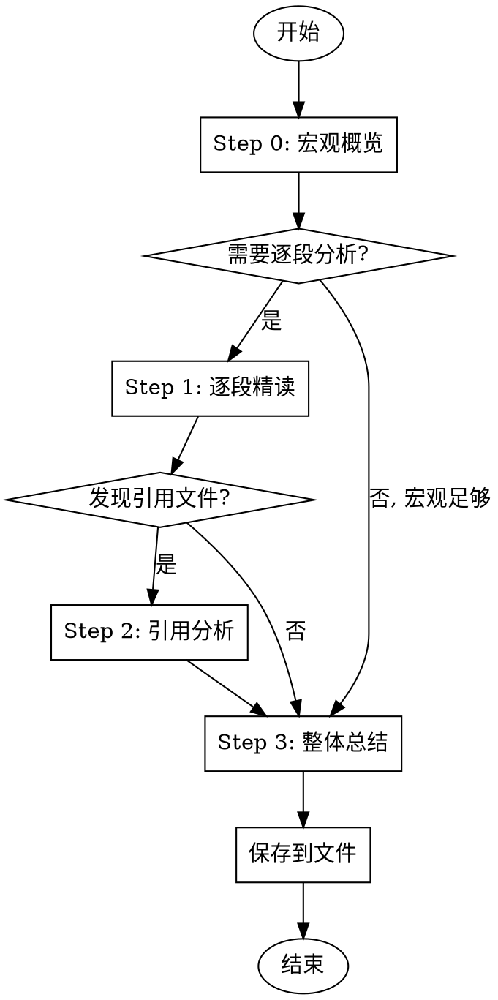

# Easy Analysis

## 概述

**先宏观，后微观。** 对复杂技术文档进行逐段精读、翻译、总结，确保彻底理解每个细节。

## 使用场景



**使用时机：**
- 用户说"分析这个文档"、"帮我理解"、"逐段分析"
- 用户明确表示"我看不懂"或"我英语不好"
- 分析 SKILL.md 文件、工作流程文档或技术规范
- 任何需要拆解复杂文档的场景

**不要使用：**
- 快速查阅（直接用 find-docs 或读取文件）
- 代码审查或调试（使用对应 skill）
- 用户只需要一句话总结

## HARD-GATE

<CRITICAL>
Do NOT start paragraph-by-paragraph reading until you have completed Step 0 (Macro Overview).
Do NOT skip translation for any paragraph.
Do NOT mix multiple paragraphs into one block.
Do NOT omit Key Points for any paragraph.

**No exceptions:**
- Not for "short documents"
- Not for "I already know what this says"
- Not for "user wants quick answer"
- Not for "these paragraphs are related"
</CRITICAL>

## 分析流程



### Step 0: 宏观概览

**在开始任何逐段阅读之前**，先提供：

```markdown
## 分析概要

### 文档定位
[一句话：这是什么类型的文档？skill/workflow/tech-spec/API doc？]

### 核心主张
[一句话：这个文档的核心观点或目的是什么？]

### 结构骨架
[用列表或表格展示文档的整体结构，不用展开细节]

### 关键洞察
[2-3个最重要的 takeaway，还没读细节就能知道的东西]

---
```

### Step 1: 逐段精读

**一个段落 = 一个块。** 绝不合并段落，即使它们看起来相关。

每个块遵循以下格式：

```markdown
### 段落 N

**原文:**
[原文，逐字复制]

**翻译:**
[中文翻译，直译但通顺]

**要点:**
- 要点 1: [为什么重要 / 隐含意义]
- 要点 2: [与其他概念的联系]
- 要点 3: [可执行的建议]
```

**要点不是翻译的总结。** 它们回答：
- 这个段落为什么存在？
- 如果删除这个段落，什么会改变？
- 这与文档的核心主张如何联系？

### Step 2: 引用文件分析

如果段落引用了外部文件，在段落后追加详细解释：

**对于脚本文件：**
- **代码结构**：分段解释，每段加注释
- **关键逻辑**：核心算法/流程说明
- **数据流**：输入输出、状态变化

**对于文档文件：**
- **结构概述**：文件整体结构
- **核心概念**：定义的关键概念
- **使用示例**：提供的示例代码

### Step 3: 整体总结

所有段落分析完成后，提供：

```markdown
## 整体总结

### 核心概念
[文档中定义的关键术语和概念]

### 工作流程
[步骤化的流程图/清单]

### 关键文件
[文件清单及其作用]
```

## 输出格式

分析结果保存到 `docs/<project-name>/` 目录：

```
<NN>-<skill-name>-analysis.md
```

示例：`07-brainstorming-skill.md`

**强制要求。** 仅聊天输出是不够的。

## 反模式

| 借口 | 为什么错 | 正确做法 |
|------|---------|---------|
| "文档很短，跳过宏观概览" | 无论长短，宏观都提供上下文 | Step 0 永不跳过 |
| "总结和翻译效果一样" | 总结 = 作者的解释；翻译 = 用户自己的解释 | 两者都需要 |
| "这些段落相关，合并吧" | 破坏粒度，用户无法定位具体段落 | 一个段落 = 一个块 |
| "翻译已经说清楚了，不要要点" | 要点解释 WHY，不是 WHAT | 两者都需要 |
| "用户只问了这篇文档" | 引用文件是文档意义的一部分 | 追踪所有引用 |
| "聊天就行，不用保存文件" | 文件提供持久参考 | 必须保存到文件 |

## 规则

1. **Step 0 优先** — 逐段阅读之前必须有宏观概览。没有例外。
2. **一个段落 = 一个块** — 绝不合并、跳过或跨段落总结。
3. **每段都翻译** — 即使看起来简单。逐字复制原文。
4. **每段都要点** — 解释为什么重要，而不只是说了什么。
5. **追踪引用** — 外部文件属于分析范围。读取并分析它们。
6. **保存到文件** — `docs/<project-name>/<NN>-<skill-name>-analysis.md`
7. **使用中文** — 所有解释、总结、要点必须用中文。
8. **保持结构层次** — 严格跟随原文的标题层级。
9. **只读原始文件** — 不要读取已有的分析文件、总结或二手来源。始终分析用户指定的一手文档。
