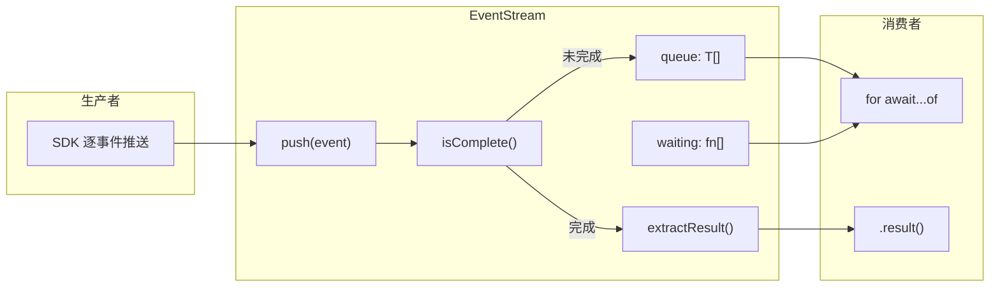
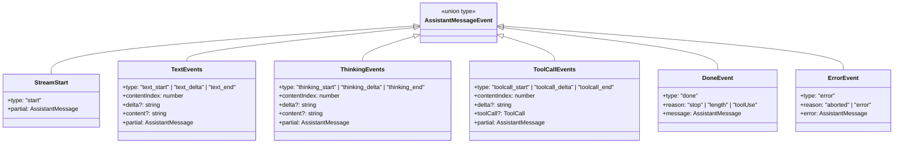
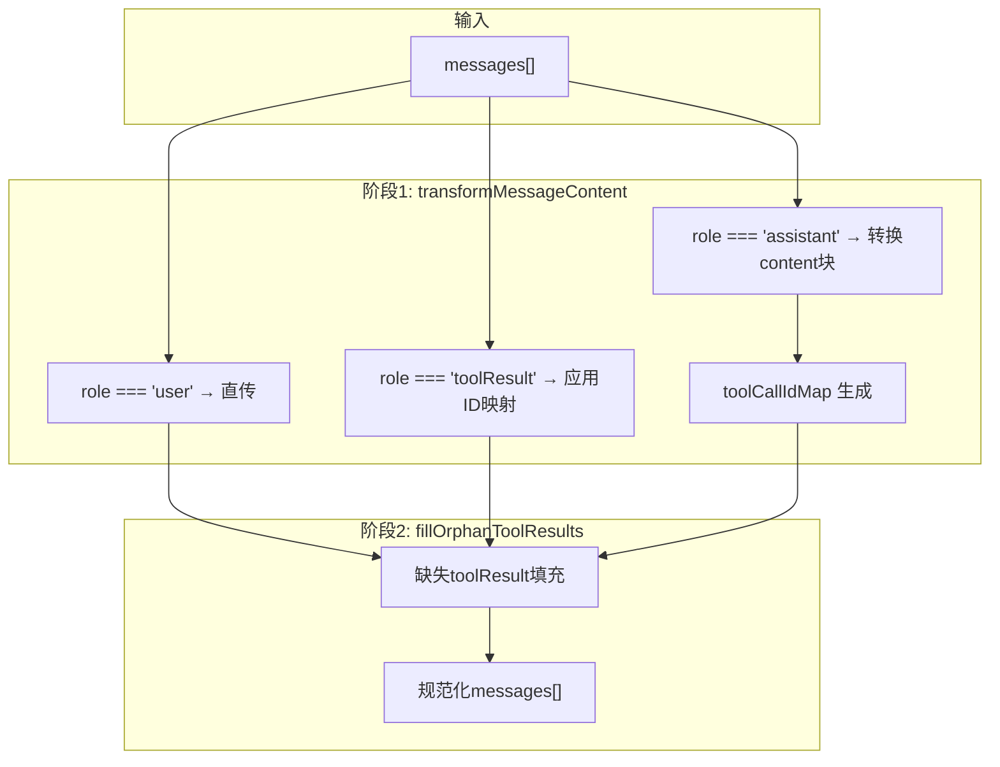
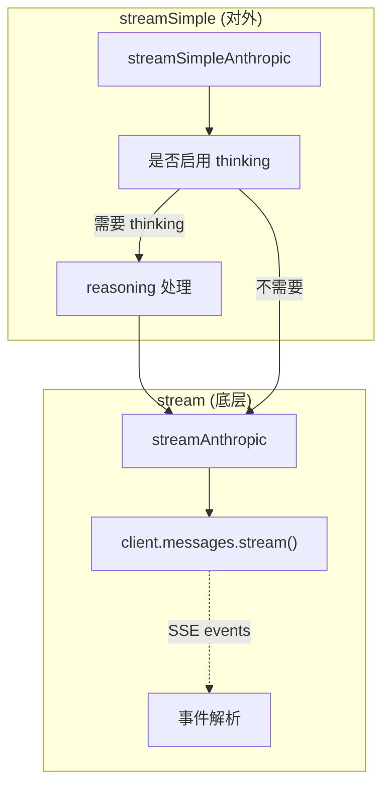
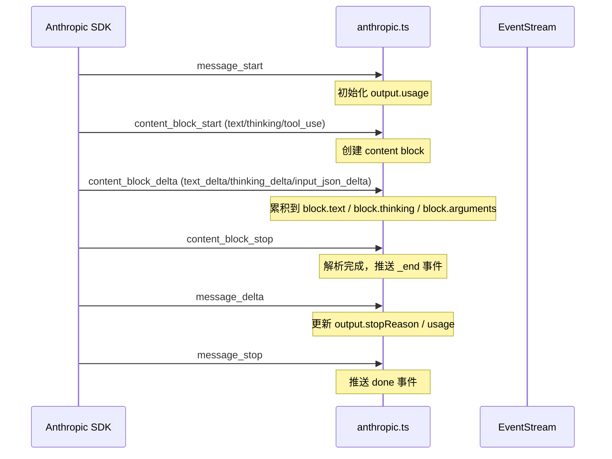
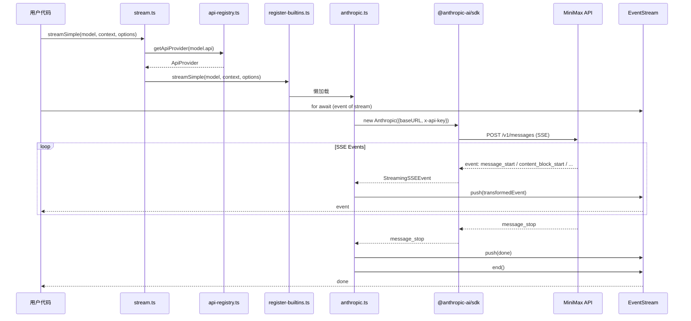
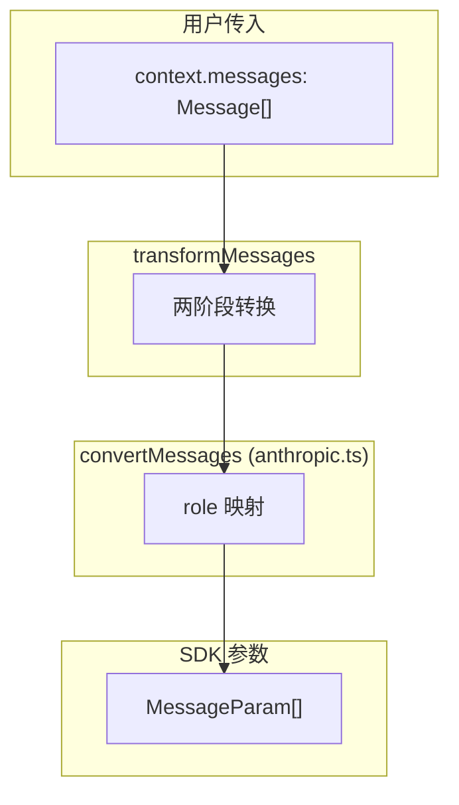

# Core/AI 架构详解

> 目标：从 OpenAI Streaming API 出发，深入掌握这套 AI 抽象层的设计与实现。

## 概念对照：OpenAI vs Anthropic Messages API

| 概念 | OpenAI | Anthropic Messages API | 本项目 |
|------|--------|-------------------------|--------|
| 流式协议 | Server-Sent Events (SSE) | SSE | 统一为 `AssistantMessageEvent` |
| 消息角色 | user/assistant/system | user/assistant | 扩展 toolResult/tool |
| Function Call | function_call + function_call_id | tool_use + id | 统一为 toolCall |
| Thinking | 不支持 | thinking block (beta) | 支持 reasoning |
| 认证 | Bearer Token | x-api-key header | 抽象为 env-api-keys |

---

## 一、事件流架构

### 1.1 为什么不用 Promise？

OpenAI 的流式接口通常返回 `ReadableStream` 或 `AsyncIterable<SSEMessage>`。这套代码用了一个更复杂的 `EventStream`：

```typescript
// src/core/ai/utils/event-stream.ts

export class EventStream<T, R = T> {
  private queue: T[] = [];           // 事件队列
  private waiting: ((value: IteratorResult<T>) => void)[] = [];  // 等待者队列
  private done = false;
  private finalResultPromise: Promise<R>;  // 最终结果
}
```

**设计意图**：

- **队列 + 等待者模式**：支持"还没人想要时就收到事件"和"还没事件时就有人来等"的两种情况
- **手动控制结束**：不是简单遍历完就结束，而是 `push(event)` 和 `end(result?)` 分开调用
- **最终结果提取**：通过 `extractResult` 函数从结束事件中提取返回值



### 1.2 事件类型体系



**与 OpenAI 的关键差异**：

OpenAI 的事件更扁平：
```json
// OpenAI
{"choices":[{"delta":{"content":"Hello"},"index":0}]}
{"choices":[{"delta":{"function_call":{"name":"get_weather","arguments":"{"}},"index":0}]}
```

本项目的结构是 **content-indexed**：
```json
// 本项目
{"type":"text_delta","contentIndex":0,"delta":"Hello",...}
{"type":"toolcall_delta","contentIndex":1,"delta":"{",...}
```

这允许同一个 `AssistantMessage` 有多个 content block 同时流式传输。

---

## 二、Provider 注册机制

### 2.1 为什么需要注册表？

OpenAI 直接调用 SDK，不需要这层抽象。这里需要支持：
- 多个 provider（MiniMax、OpenAI、Google...）
- 每个 provider 有多个 API 类型
- 懒加载避免首屏延迟

```mermaid
graph TB
    subgraph "注册阶段 (模块加载时)"
        RB["register-builtins.ts"]
        Reg["api-registry.ts"]
        Anth["providers/anthropic.ts"]
    end

    subgraph "调用阶段 (运行时)"
        Stream["stream.ts"]
        GetModel["models.ts"]
    end

    RB -->|registerApiProvider| Reg
    RB -.->|lazy import| Anth
    Anth -.->|export streamSimple| RB
    Stream -->|getApiProvider(api)| Reg
    GetModel -->|getModel(provider, id)| Reg
```

### 2.2 注册表核心 API

```typescript
// src/core/ai/api-registry.ts

interface ApiProvider<TApi, TOptions> {
  api: TApi;
  stream: StreamFunction<TApi, TOptions>;
  streamSimple: StreamFunction<TApi, SimpleStreamOptions>;
}

// 注册
registerApiProvider({
  api: "anthropic-messages",
  stream: streamAnthropic,
  streamSimple: streamSimpleAnthropic,
});

// 查询
const provider = getApiProvider("anthropic-messages");
```

### 2.3 懒加载模式

```typescript
// src/core/ai/providers/register-builtins.ts

let anthropicProviderModulePromise: Promise<...> | undefined;

function loadAnthropicProviderModule() {
  anthropicProviderModulePromise ||= import("./anthropic.js").then(...);
  return anthropicProviderModulePromise;
}

export const streamAnthropic = createLazyStream(loadAnthropicProviderModule, m => m.stream);
```

---

## 三、消息转换：跨 Provider 的桥梁

### 3.1 问题背景

跨 provider 对话时，消息格式需要规范化：

| Provider | Tool Call 结构 | Thinking 结构 |
|----------|---------------|---------------|
| MiniMax | `{type:"toolCall",id:"...",name:"...",arguments:{}}` | `{type:"thinking",thinking:"...",thinkingSignature:"..."}` |
| OpenAI | `{type:"function",id:"...",name:"...",parsing}` | 不支持 |

`transformMessages` 做两件事：

1. **内容转换**：同模型保留，跨模型标准化
2. **孤立 toolCall 填充**：没有对应 toolResult 的 toolCall 补充错误状态



### 3.2 Assistant Content 块转换规则

```typescript
// src/core/ai/providers/transform-messages.ts

// thinking 块
if (block.type === "thinking") {
  if (block.redacted) return isSameModel ? block : [];  // 被屏蔽：仅同模型保留
  if (isSameModel && block.thinkingSignature) return block;  // 有签名：保留
  if (!block.thinking?.trim()) return [];  // 空：丢弃
  if (isSameModel) return block;  // 同模型：保留
  return { type: "text", text: block.thinking };  // 跨模型：转text
}

// toolCall 块
if (block.type === "toolCall") {
  if (!isSameModel && toolCall.thoughtSignature) {
    // 移除跨模型的 thought 签名
    delete normalizedToolCall.thoughtSignature;
  }
  if (!isSameModel && normalizeToolCallId) {
    // 标准化 toolCall ID
    const normalizedId = normalizeToolCallId(toolCall.id, model, msg);
    toolCallIdMap.set(toolCall.id, normalizedId);
  }
}
```

---

## 四、Anthropic Provider 实现

### 4.1 双层流函数



`streamSimple` 是面向用户的简化接口，自动处理 reasoning 相关逻辑：

```typescript
// src/core/ai/providers/anthropic.ts

export const streamSimpleAnthropic = (model, context, options) => {
  if (!options?.reasoning) {
    // 不需要 thinking：直接调用底层 stream，禁用 thinking
    return streamAnthropic(model, context, { ...base, thinkingEnabled: false });
  }

  if (supportsAdaptiveThinking(model.id)) {
    // 支持自适应 thinking（如 Claude 4.6）
    return streamAnthropic(model, context, { ...base, thinkingEnabled: true, effort });
  }

  // 传统模式：手动指定 budget_tokens
  return streamAnthropic(model, context, {
    ...base,
    thinkingEnabled: true,
    thinkingBudgetTokens: adjusted.thinkingBudget,
  });
};
```

### 4.2 SDK 事件到 AssistantMessageEvent 的映射



### 4.3 Anthropic vs OpenAI Tool Use

| 方面 | OpenAI | Anthropic |
|------|--------|-----------|
| 结构 | `function_call` + `name` + `arguments: string` | `tool_use` + `name` + `input: object` |
| ID 生成 | 模型自动生成 | 模型自动生成，需标准化 |
| 参数流式 | 整个 delta 是字符串 | `input_json_delta` 累积 JSON |
| 结束信号 | `function_call` 结束块 | `content_block_stop` |
| 结果回传 | `tool_results` role | `tool_result` role |

```typescript
// OpenAI 风格
{type: "function_call", id: "call_abc", name: "get_weather", arguments: "{\"city\": \"Tokyo\"}"}

// Anthropic 风格
{type: "tool_use", id: "toolu_abc", name: "get_weather", input: {city: "Tokyo"}}

// 本项目统一为
{type: "toolCall", id: "toolu_abc", name: "get_weather", arguments: {city: "Tokyo"}}
```

---

## 五、完整调用流程



---

## 六、关键代码路径

### 6.1 获取模型 → 调用流

```mermaid
flowchart LR
    A["getModel('minimax-cn', 'MiniMax-M2.7')"] --> B["model: Model<'anthropic-messages'>"]
    B --> C["streamSimple(model, context, options)"]
    C --> D["getApiProvider('anthropic-messages')"]
    D --> E["streamSimpleAnthropic(model, context, options)"]
    E --> F["streamAnthropic(model, context, opts)"]
    F --> G["new Anthropic({baseURL, x-api-key})"]
    G --> H["client.messages.stream(params)"]
```



### 6.2 消息 → SDK 参数



---

## 七、扩展指南

### 7.1 添加新 Provider（如 OpenAI）

需要修改/新增的文件：

1. **`models.generated.ts`** - 添加模型定义
2. **`providers/openai.ts`** - 实现 `streamAnthropic`/`streamSimpleAnthropic` 接口
3. **`providers/register-builtins.ts`** - 注册新 provider
4. **`env-api-keys.ts`** - 添加 API Key 映射
5. **`api-registry.ts`** - 如需新 API 类型

### 7.2 关键接口契约

```typescript
// 必须实现的接口
interface Provider {
  api: "anthropic-messages" | "openai" | ...;
  stream: StreamFunction<TApi, TOptions>;
  streamSimple: StreamFunction<TApi, SimpleStreamOptions>;
}

// StreamFunction 签名
type StreamFunction<TApi, TOptions> = (
  model: Model<TApi>,
  context: Context,
  options?: TOptions,
) => AssistantMessageEventStream;
```

---

## 八、调试技巧

### 8.1 追踪事件流

```typescript
const stream = streamSimple(model, context, options);

for await (const event of stream) {
  console.log(`[${event.type}]`, JSON.stringify(event).slice(0, 200));
}
```

### 8.2 检查 Provider 注册

```typescript
import { getApiProvider, getApiProviders } from './api-registry.js';

console.log(getApiProviders().map(p => p.api));
// ['anthropic-messages']
```

### 8.3 查看模型配置

```typescript
import { getModel, getProviders, getModels } from './models.js';

console.log(getProviders());  // ['minimax', 'minimax-cn']
console.log(getModels('minimax-cn'));
```
