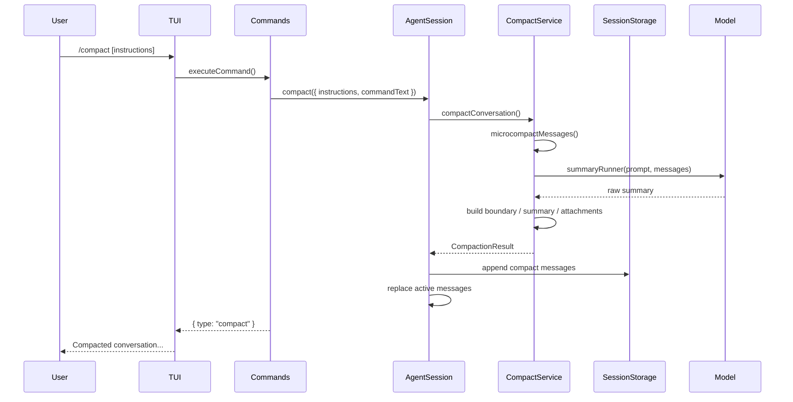

# Compact 技术文档

> 分析对象：`src/commands/compact/*`, `src/session/compact/*`, `src/agent/session.ts` @ 73baf03
> 日期：2026-05-03

---

## 一句话定义

`/compact` 是 ys-code 中的**手动上下文压缩命令**：它把当前会话的长历史压缩成结构化摘要，并用新的 active messages 接管后续模型上下文。

它不是普通 prompt command。用户输入 `/compact` 后，TUI 只显示本地命令结果，不会把 `/compact` 发送给主模型继续回答。

## 架构图

## 文档索引

| 文档 | 内容 | 一句话摘要 |
|------|------|-----------|
| [01-overview](./01-overview.md) | 宏观设计 | compact 解决什么问题，以及本期不做什么 |
| [02-runtime-flow](./02-runtime-flow.md) | 运行时链路 | 从 `/compact` 输入到阻止主模型 query 的完整路径 |
| [03-message-model](./03-message-model.md) | 消息模型 | `compact_boundary`、summary、命令记录和 attachment 的顺序 |
| [04-summary-and-microcompact](./04-summary-and-microcompact.md) | 摘要与微压缩 | summary prompt、`tools: []` 和旧 tool result 清理 |
| [05-attachments](./05-attachments.md) | 附件恢复 | compact 后如何恢复最近读过的文件 |
| [06-persistence-and-restore](./06-persistence-and-restore.md) | 持久化与恢复 | append-only transcript 与 latest boundary restore |
| [07-safety-and-failure-modes](./07-safety-and-failure-modes.md) | 安全与失败模式 | 原子性、并发保护、secret 防护和残余风险 |
| [08-testing-map](./08-testing-map.md) | 测试覆盖地图 | 关键行为对应的测试文件 |

## 相关文档

| 文档 | 位置 | 说明 |
|------|------|------|
| 设计规格 | `docs/ys-powers/specs/2026-05-02-compact-command-design.md` | `/compact` 的原始设计目标和边界 |
| 实施计划 | `docs/ys-powers/plans/2026-05-02-compact-command.md` | TDD 分阶段实施任务 |
| Claude Code compact SOP | `docs/sop/sop-20260421-001-cc-compact-source-code-analysis.md` | Claude Code compact 机制的历史分析 |

## 维护约定

- 主流程变更时优先更新 [02-runtime-flow](./02-runtime-flow.md)。
- 新增或调整 message ordering 时同步更新 [03-message-model](./03-message-model.md)。
- 修改 secret、路径、权限、并发保护时同步更新 [07-safety-and-failure-modes](./07-safety-and-failure-modes.md)。
- 新增测试或调整测试职责时同步更新 [08-testing-map](./08-testing-map.md)。
