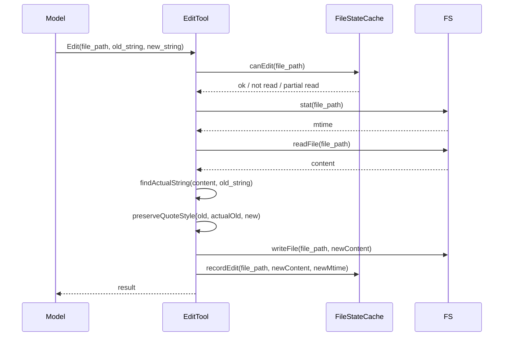

# EditTool 技术文档

> 分析对象：src/agent/tools/edit.ts @ da24438, src/agent/file-state.ts @ da24438
> 日期：2026-04-24

---

## 一句话定义

EditTool 是 ys-code 中用于**精确字符串替换**的文件编辑工具，具备先读后写、脏写检测、引号规范化三大安全机制。

## 架构图

## 文档索引

| 文档 | 内容 | 一句话摘要 |
|------|------|-----------|
| [01-execution-flow](./01-execution-flow.md) | 完整执行时序 | validateInput → execute 的完整链路 |
| [02-read-before-write](./02-read-before-write.md) | 先读后写机制 | 为什么必须先 Read 才能 Edit |
| [03-dirty-write-detection](./03-dirty-write-detection.md) | 脏写检测 | 双层检测防止外部修改覆盖 |
| [04-quote-normalization](./04-quote-normalization.md) | 引号规范化 | curly quotes 匹配与风格保留 |
| [05-file-state-cache](./05-file-state-cache.md) | FileStateCache | LRU 缓存设计与读取凭证模型 |
| [06-error-handling](./06-error-handling.md) | 错误码体系 | 7 个错误码的触发条件与恢复路径 |
| [07-testing](./07-testing.md) | 测试覆盖 | 22 个测试的覆盖矩阵与未覆盖场景 |
| [08-cc-comparison](./08-cc-comparison.md) | cc 差异对比 | 功能对齐度与演进决策记录 |

## 相关外部文档

| 文档 | 位置 | 说明 |
|------|------|------|
| cc EditTool 源码分析 | `docs/cc/2026-04-23-cc-EditTool-源码分析.md` | cc 的完整时序分析 |
| cc 对比 | `docs/cc/edit-tool-comparison.md` | 早期对比文档 |
| 演进设计 | `docs/plan/2026-04-23-read-before-write-design.md` | 先读后写机制设计 |
| 演进 Spec | `docs/superpowers/specs/2026-04-23-edittool-evolution-design.md` | 演进方案设计 |

## 维护约定

- 源码变更时优先更新 [01-execution-flow](./01-execution-flow.md)
- 新增安全机制时按编号规则新增文档（如 `02x-xxx.md`）
- [08-cc-comparison](./08-cc-comparison.md) 仅在做出新的对齐/差异决策时更新
- 文档之间通过相对链接引用，避免信息重复
