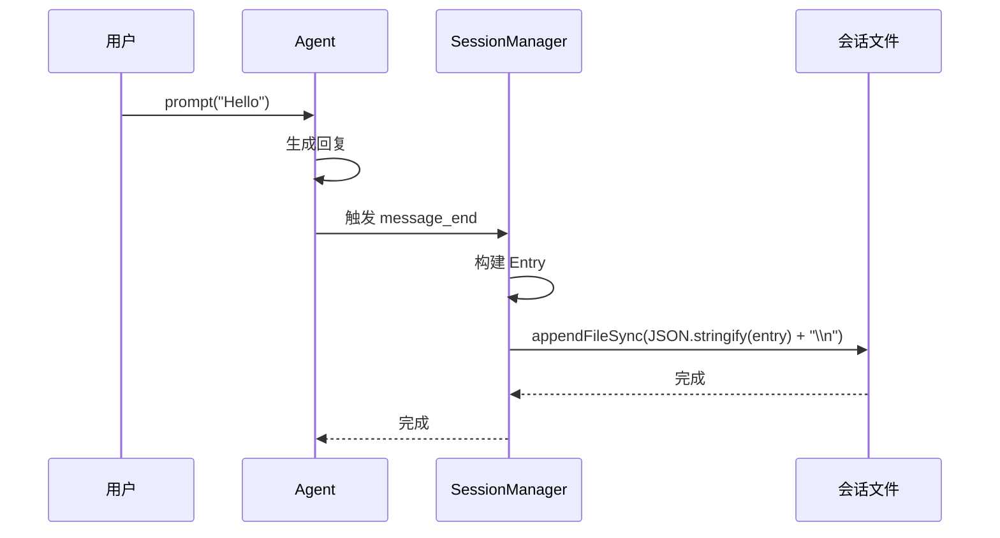
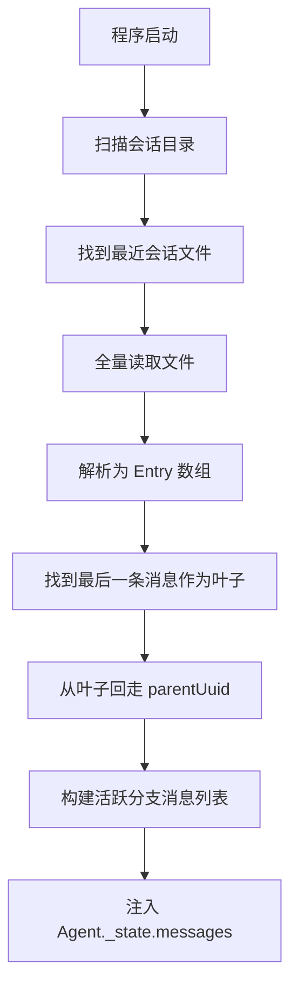
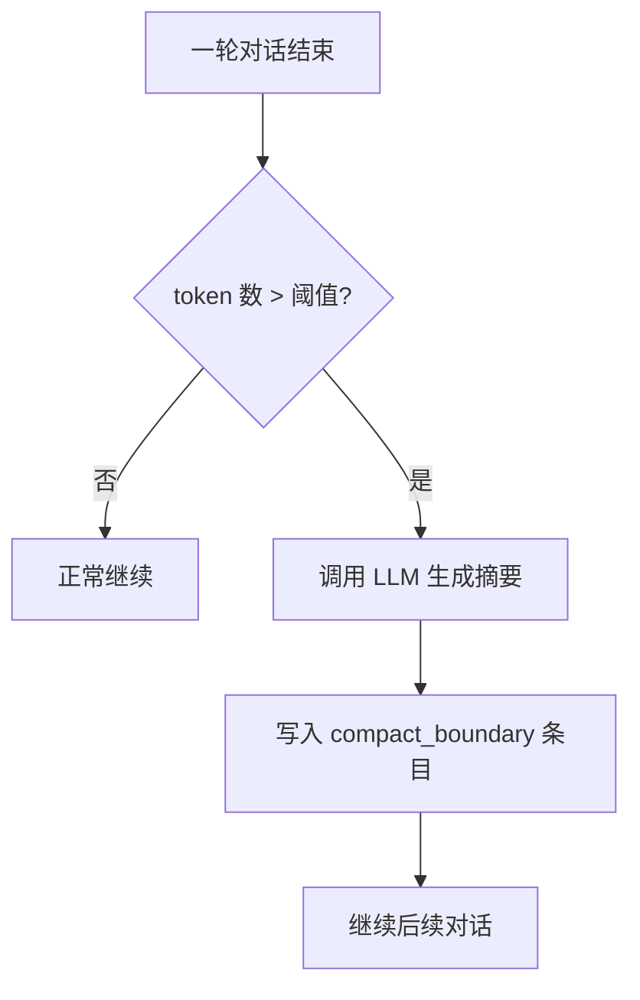
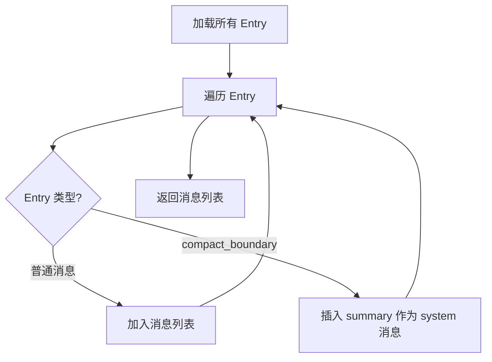
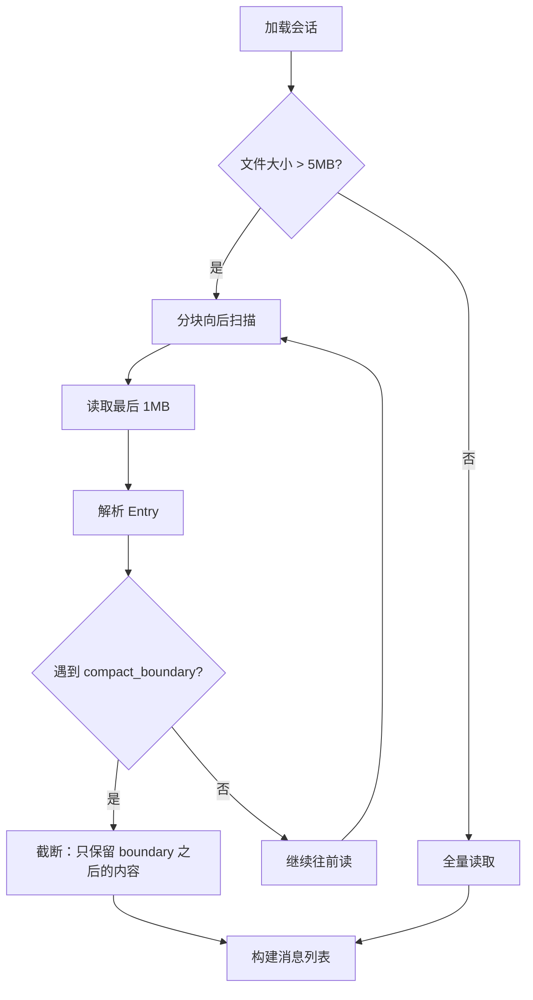

# ys-code 持久化与 Compact 机制设计方案

> 创建时间: 2026-04-21
> 状态: 方案确认中
> 核心决策: 数据结构向 CC 对齐，加载逻辑渐进优化

---

## 1. 概述

### 1.1 当前现状

ys-code 当前**纯内存存储**，`Agent._state.messages` 是 `AgentMessage[]` 数组，退出即丢失。无持久化、无会话恢复、无 compact。

### 1.2 设计目标

1. **会话持久化**: 对话历史保存到磁盘，重启后可恢复
2. **上下文压缩（Compact）**: token 超过阈值时，自动将历史替换为摘要
3. **渐进演进**: 初期简单，后期可无缝升级性能优化
4. **尽早暴露问题**: 每个阶段都有明确的风险点和回退方案

### 1.3 核心设计决策

| 维度         | 决策                                                                |
| ---------- | ----------------------------------------------------------------- |
| Entry 格式   | 独立类型体系（header / user / assistant / toolResult / compact_boundary） |
| 消息链接       | `parentUuid`（DAG 结构，支持未来 fork）                                    |
| Compact 标记 | `compact_boundary`（CC 语义）                                         |
| Summary 角色 | 恢复时转为 `system` 消息注入 context                                       |
| 加载策略       | Phase 1 全量读取 → Phase 3 分块截断                                       |
| 会话恢复       | header 记录 sessionId，从最后叶子回走 root                                  |

---

## 2. 数据结构

### 2.1 Entry 类型体系

```
文件: ~/.ys-code/sessions/<cwd-hash>/<sessionId>.jsonl
每行一个 JSON entry

Entry 基类:
  - type: string           // 条目类型
  - uuid: string           // 唯一标识
  - parentUuid: string|null  // 父条目（链式/DAG 结构）
  - timestamp: number      // 时间戳

HeaderEntry:
  - type: "header"
  - version: 1
  - sessionId: string
  - cwd: string

UserEntry:
  - type: "user"
  - content: 文本或内容块数组
  - isMeta?: boolean       // UI 隐藏，LLM 可见

AssistantEntry:
  - type: "assistant"
  - content: 内容块数组
  - model: string
  - usage: Token 使用量
  - stopReason: 停止原因
  - errorMessage?: string

ToolResultEntry:
  - type: "toolResult"
  - toolCallId: string
  - toolName: string
  - content: 结果内容
  - isError: boolean

CompactBoundaryEntry:
  - type: "compact_boundary"
  - summary: string        // 摘要内容
  - tokensBefore: number   // 压缩前 token 数
  - tokensAfter: number    // 压缩后 token 数
```

### 2.2 文件示例

```json
{"type":"header","uuid":"hdr-1","parentUuid":null,"timestamp":1000,"version":1,"sessionId":"sess-abc","cwd":"/projects/ys-code"}
{"type":"user","uuid":"msg-1","parentUuid":"hdr-1","timestamp":1001,"content":"Hello"}
{"type":"assistant","uuid":"msg-2","parentUuid":"msg-1","timestamp":1002,"content":"Hi","usage":{...}}
{"type":"user","uuid":"msg-3","parentUuid":"msg-2","timestamp":1003,"content":"How are you?"}
{"type":"assistant","uuid":"msg-4","parentUuid":"msg-3","timestamp":1004,"content":"Good","usage":{...}}
```

---

## 3. 技术演进（三个阶段）

### Phase 1: 基础持久化

**目标**: 消息写入磁盘，重启后可恢复。无 compact，无性能优化。

#### 写入流程

```
当用户发送消息时:
  1. Agent 处理消息，生成 assistant 回复
  2. 收到 message_end 事件
  3. 将消息追加到会话文件（JSONL 格式）
```



#### 加载流程

```
当程序启动时:
  1. 扫描会话目录，找最近修改的会话文件
  2. 读取文件所有行
  3. 解析每行为 Entry
  4. 从最后一条消息回走 parentUuid，构建活跃分支
  5. 将活跃分支的消息注入 Agent._state.messages
```



#### 核心逻辑（中文伪代码）

```
函数 写入条目(条目):
    文件.追加内容(JSON.stringify(条目) + "\n")

函数 加载会话(文件路径):
    内容 = 文件.读取全部(文件路径)
    行列表 = 内容.按行分割().过滤(非空)
    条目列表 = 行列表.映射(解析JSON)
    返回 条目列表

函数 恢复消息(条目列表):
    如果 条目列表 为空:
        返回 []

    // 找到叶子节点（最后一条消息）
    有父节点的 = 新集合()
    对于 条目 在 条目列表 中:
        如果 条目.parentUuid 不为空:
            有父节点的.添加(条目.parentUuid)

    叶子列表 = []
    对于 条目 在 条目列表 中:
        如果 条目.uuid 不在 有父节点 中:
            叶子列表.添加(条目)

    如果 叶子列表 为空:
        返回 []

    // 取最后一个叶子（最新会话）
    当前叶子 = 叶子列表[最后一个]

    // 从叶子回走构建路径
    路径 = []
    当 当前叶子 不为空:
        路径.前面插入(当前叶子)
        当前叶子 = 查找父条目(当前叶子.parentUuid, 条目列表)

    // 转换为 AgentMessage
    消息列表 = []
    对于 条目 在 路径 中:
        如果 条目.type == "header":
            跳过
        消息列表.添加(条目转消息(条目))

    返回 消息列表
```

#### Phase 1 风险点

| 问题 | 影响 | 缓解方案 |
|------|------|----------|
| 文件损坏（JSON 解析失败） | 无法恢复会话 | 逐行解析，跳过损坏行，记录警告 |
| 并发写入（多实例） | 文件内容错乱 | 使用 `proper-lockfile` 加文件锁 |
| 会话文件无限增长 | 加载变慢 | Phase 3 引入分块截断，或定期清理旧会话 |
| 没有版本号 | 格式升级不兼容 | HeaderEntry 带 version 字段，支持版本检测 |

---

### Phase 2: 引入 Compact

**目标**: 当 token 超过阈值时，将历史消息替换为 summary。

#### Compact 触发时机

```
当一轮对话结束时:
  1. 估算当前消息列表的总 token 数
  2. 如果超过阈值（如 100k tokens）:
     a. 调用 LLM 生成历史摘要
     b. 写入 compact_boundary 标记
```



#### Compact 后的恢复逻辑

```
加载会话时，遇到 compact_boundary:
  1. 将 summary 作为 system 消息插入
  2. compact_boundary 之前的历史消息被"替换"掉
  3. compact_boundary 之后的消息正常保留
```



#### 核心逻辑（中文伪代码）

```
函数 触发Compact(消息列表):
    总token = 估算Token数(消息列表)
    如果 总token < COMPACT阈值:
        返回

    // 生成摘要
    摘要 = 调用LLM生成摘要(消息列表)
    摘要token = 估算Token数(摘要)

    // 写入 compact_boundary
    边界条目 = {
        type: "compact_boundary",
        uuid: 生成UUID(),
        parentUuid: 获取最后一条消息的uuid,
        timestamp: 当前时间,
        summary: 摘要,
        tokensBefore: 总token,
        tokensAfter: 摘要token
    }
    写入条目(边界条目)

函数 恢复消息含Compact(条目列表):
    消息列表 = []

    对于 条目 在 条目列表 中:
        如果 条目.type == "compact_boundary":
            // 替换历史：插入 summary 作为 system 消息
            消息列表.添加({
                role: "system",
                content: 条目.summary
            })
            继续

        如果 条目.type == "header":
            跳过

        消息列表.添加(条目转消息(条目))

    返回 消息列表
```

#### Phase 2 关键问题：消息链的断裂

Compact 后，消息链会出现一个**断裂点**：

```
Compact 前: msg-1 → msg-2 → msg-3 → msg-4 → msg-5
                  ↑
            parentUuid 链

Compact 后: msg-1 → msg-2 → msg-3 → msg-4 → compact_boundary → msg-6
                  ↑                          ↑
            被替换为 summary                 msg-6.parentUuid 指向 compact_boundary
```

**这意味着 compact_boundary 同时承担两个角色：**
1. **压缩标记**：告诉恢复逻辑"前面的内容已被摘要替换"
2. **链接节点**：作为 DAG 中的正常节点，让后续消息有 parent 可指

#### Phase 2 风险点

| 问题 | 影响 | 缓解方案 |
|------|------|----------|
| Summary 质量差 | 丢失关键上下文 | 使用结构化摘要格式（CC 的 9-section XML），保留最近 N 条消息 |
| Compact 过于频繁 | 性能开销，摘要嵌套 | 设置 compact 冷却期（如 30 分钟内不重复 compact） |
| Summary 本身也超 token | 恶性循环 | Summary 长度限制（如最多 4k tokens），超长时截断 |
| Token 估算不准 | 实际还是超窗口 | 使用 tiktoken 或 provider 的 token 计数器，留出安全余量（如 80% 阈值） |
| **LLM 生成摘要失败** | **Compact 无法完成，token 持续增长** | **失败时记录日志，标记为"未压缩"，下次重试；或降级为只保留最近 N 条消息** |
| **Compact 期间新消息到来** | **并发写入可能损坏文件** | **Compact 异步执行，用文件锁保护写入；或 compact 期间阻塞新消息** |

---

### Phase 3: 性能优化（分块截断加载）

**目标**: 文件 > 5MB 时，不加载 compact_boundary 之前的内容。

#### 核心思路

```
文件小的时候: 全量读取（复用 Phase 1 逻辑）
文件大的时候: 从后往前读，遇到 compact_boundary 就停，前面的不加载
```



#### 核心逻辑（中文伪代码）

```
函数 加载会话优化版(文件路径):
    文件大小 = 文件.获取大小(文件路径)

    如果 文件大小 < 5MB:
        // 小文件：复用 Phase 1 逻辑
        返回 加载会话(文件路径)

    // 大文件：分块向后扫描
    结果条目 = []
    已找到边界 = false
    块大小 = 1MB
    上一块尾部 = ""   // 关键：处理跨块切割

    偏移量 = 文件大小
    当 偏移量 > 0 且 未找到边界:
        偏移量 = 最大(0, 偏移量 - 块大小)
        块内容 = 文件.读取片段(文件路径, 偏移量, 块大小)

        // 拼接前一块的尾部（处理跨块切割）
        如果 上一块尾部 不为空:
            块内容 = 块内容 + 上一块尾部

        行列表 = 块内容.按行分割()

        // 保存当前块的第一行（可能不完整，留给下一次循环拼接）
        如果 偏移量 > 0:
            上一块尾部 = 行列表[第一个]
            行列表.删除第一个()

        // 从后往前处理（因为是从文件尾部开始读）
        对于 i 从 行列表.长度-1 到 0:
            行 = 行列表[i]
            如果 行 为空:
                继续

            条目 = 解析JSON(行)
            结果条目.前面插入(条目)  // 保持顺序

            如果 条目.type == "compact_boundary":
                已找到边界 = true
                跳出循环

    返回 结果条目
```

#### Phase 3 核心问题：块边界切割

分块读取时，一个 JSON 行可能被切到两个块中间：

```
块 N 末尾:   ... { "type": "user", "uuid": "msg-50",
块 N+1 开头: "parentUuid": "msg-49", "content": "..." }
```

**解决方案：保留前一块的尾部片段**

```
函数 加载会话优化版(文件路径):
    文件大小 = 文件.获取大小(文件路径)

    如果 文件大小 < 5MB:
        返回 加载会话(文件路径)

    结果条目 = []
    已找到边界 = false
    块大小 = 1MB
    上一块尾部 = ""   // 保存前一块末尾的不完整行

    偏移量 = 文件大小
    当 偏移量 > 0 且 未找到边界:
        偏移量 = 最大(0, 偏移量 - 块大小)
        块内容 = 文件.读取片段(文件路径, 偏移量, 块大小)

        // 拼接前一块的尾部（处理跨块切割）
        如果 上一块尾部 不为空:
            块内容 = 块内容 + 上一块尾部

        行列表 = 块内容.按行分割()

        // 保存当前块的第一行（可能不完整，留给下一次循环拼接）
        如果 偏移量 > 0:
            上一块尾部 = 行列表[第一个]
            行列表.删除第一个()

        // 从后往前处理
        对于 i 从 行列表.长度-1 到 0:
            行 = 行列表[i]
            如果 行 为空:
                继续

            条目 = 解析JSON(行)
            结果条目.前面插入(条目)

            如果 条目.type == "compact_boundary":
                已找到边界 = true
                跳出循环

    返回 结果条目
```

#### Phase 3 风险点

| 问题 | 影响 | 缓解方案 |
|------|------|----------|
| **块切到行中间** | **JSON 解析失败** | **保留前一块尾部拼接（已在伪代码中实现）** |
| compact_boundary 前有保留段 | 需要加载 boundary 前的部分消息 | 实现 `preservedSegment` 机制（标记保留几条） |
| **多个 compact_boundary** | **只应保留最后一个** | **从后往前扫描，遇到第一个 boundary 就停** |
| 文件锁与分块读取冲突 | 读取不完整 | 读取前加共享锁，或接受可能读到不完整数据（JSON 解析失败则跳过） |
| **没有 compact_boundary 的大文件** | **Phase 3 无法截断，全量加载依然慢** | **这是一个信号：应该触发 compact 了！** |

---

## 4. 演进时间线与问题暴露

### 4.1 没有 Compact 的情况

如果不做 Phase 2（compact），只实现 Phase 1 + Phase 3：

```
Phase 1（基础持久化）上线:
  → 文件增长: 每轮对话 ~2-10KB
  → 1000 轮对话后: ~2-10MB
  → 10000 轮对话后: ~20-100MB

Phase 3（分块截断）触发条件:
  → 文件 > 5MB 时启用分块读取
  → 但如果没有 compact_boundary，分块截断无法生效！
  → 结果: 文件越来越大，加载越来越慢，直到无法使用
```

**结论：没有 compact，Phase 3 的优化形同虚设。**

### 4.2 有 Compact 的情况

```
Phase 1 + Phase 2 上线:
  → 文件增长到有 compact_boundary 标记
  → compact 将历史替换为 summary（~1-4KB）
  → 文件大小被"重置"到合理范围
  → 即使不实现 Phase 3，性能也可接受

Phase 3 按需上线:
  → 只有极端情况下（超长会话未 compact）才需要
  → 或 compact 后仍有大量消息的场景
```

### 4.3 关键洞察

**Compact 是持久化的"刹车片"，不是可选功能。**

| 场景 | 无 Compact | 有 Compact |
|------|-----------|-----------|
| 日常开发（~100 轮/天） | 1 周后文件 10MB+ | 文件维持在 1-2MB |
| 长期项目（~3 个月） | 文件 100MB+，加载 5 秒+ | 文件始终可控 |
| Phase 3 必要性 | 必须立即做，否则不可用 | 可以延后，按需优化 |

---

## 5. 各阶段工作量预估

| 阶段 | 工作量 | 核心文件 | 测试重点 |
|------|--------|----------|----------|
| Phase 1 | ~2 天 | `session-manager.ts` | 写入/加载/恢复/并发锁 |
| Phase 2 | ~3 天 | `compact.ts`, `session-manager.ts` | 触发阈值/摘要质量/恢复替换 |
| Phase 3 | ~2 天 | `session-loader.ts` | 分块边界/截断正确性/性能对比 |

---

## 5. 关键决策确认

### 5.1 已确定

- [x] Entry 类型体系（5 种类型）
- [x] `parentUuid` DAG 结构
- [x] `compact_boundary` 独立类型（不是 system 子类型）
- [x] Summary 恢复时转为 `system` 消息
- [x] 渐进三阶段实现

### 5.2 待确认（附建议）

| 问题 | 建议方案 | 如果选错的风险 |
|------|----------|---------------|
| **Token 估算方式** | Phase 1 用字符数估算（简单）；Phase 2 引入 tiktoken（精确） | 字符数估算误差可达 30%，可能导致过早/过晚触发 compact |
| **Compact 阈值** | 模型上下文窗口的 80%（如 200k 窗口 → 160k 阈值） | 太高可能超窗口，太低频繁 compact 浪费 token |
| **保留消息数** | 保留最近 10 条消息（`preservedSegment: 10`） | 不保留可能丢失刚讨论的上下文；保留太多摘要意义下降 |
| **会话文件命名** | `<timestamp>_<sessionId>.jsonl`（Pi-mono 风格，便于排序） | `sessionId.jsonl` 无法按时间排序找最新会话 |
| **旧会话清理** | 保留最近 30 个会话，删除旧的 | 不清理占用磁盘；清理太激进丢失历史 |

### 5.3 如果设计错了怎么办

**回退策略：**

| 假设失败 | 回退方案 |
|----------|----------|
| `compact_boundary` 格式不适用 | 保留原始消息 + 新增 `compaction_v2` entry，加载时兼容旧格式 |
| `parentUuid` DAG 太复杂 | 退化回简单数组（`parentUuid` 始终指向上一条），零数据迁移 |
| 文件锁导致性能问题 | 去掉锁，接受极少概率的写入冲突（JSONL 格式天然可容忍部分损坏） |
| Token 估算完全不准 | 直接暴露 token 数给用户，让用户手动触发 compact |
| SessionManager 设计错误 | 它只是一个封装层，可以重写内部实现，不暴露给 Agent 的接口不变 |

---

## 6. 附录：与现有代码集成点

```
AgentSession 构造函数:
  1. 初始化 SessionManager（传入 cwd）
  2. 调用 sessionManager.restoreMessages()
  3. 如果有恢复的消息，设置到 agent.state.messages

Agent 的 message_end 事件处理:
  1. 调用 sessionManager.appendMessage(event.message)
  2. 调用 sessionManager.compactIfNeeded()（可选：异步触发）
```
