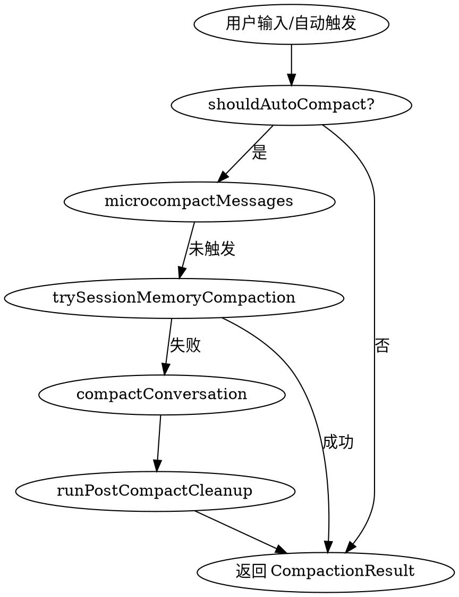

## 背景

Claude Code 的 Compact（上下文压缩）系统是管理对话上下文长度的核心机制。当对话 Token 数量接近模型上下文窗口限制时，系统会自动或手动触发压缩，将历史消息压缩为摘要，释放上下文空间。

## 解决方案

### 核心文件结构

```
src/services/compact/
├── compact.ts                 # 核心压缩引擎
├── autoCompact.ts             # 自动压缩触发器
├── microCompact.ts            # 微压缩（轻量级清理）
├── sessionMemoryCompact.ts    # 会话记忆压缩（实验性）
├── prompt.ts                  # 压缩提示词模板
├── grouping.ts                # 消息分组工具
├── postCompactCleanup.ts      # 压缩后清理
├── compactWarningState.ts      # 警告状态管理
├── timeBasedMCConfig.ts        # 时间触发配置
└── apiMicrocompact.ts          # API 侧上下文管理
```

### 压缩流程图



### 关键信息

#### 1. compact.ts — 核心压缩引擎

- `compactConversation()` — 全量压缩
  - 流程：执行 pre-compact hooks → 生成摘要 → 清理文件缓存 → 重新注入附件 → 执行 post-compact hooks
  - 支持自定义指令和 hook 指令合并
  - 使用 `streamCompactSummary()` 生成摘要

- `partialCompactConversation()` — 部分压缩
  - 支持 `from`（保留早期消息）和 `up_to`（保留最新消息）两种方向
  - `from` 保留前缀缓存，`up_to` 会使缓存失效

- `streamCompactSummary()` — 流式摘要生成
  - **Forked Agent 路径**（默认）：复用主对话的 prompt cache
  - **Regular Streaming 路径**：降级方案，直接调用 API

- `stripImagesFromMessages()` — 图片剥离
  - 用户消息中的图片会被替换为 `[image]` 占位符
  - 防止压缩请求本身超出 token 限制

- `createPostCompactFileAttachments()` — 恢复最近访问文件
  - 压缩后重新注入最多 5 个最近访问的文件（每个最多 5K tokens）
  - 总预算 50K tokens

- `createSkillAttachmentIfNeeded()` — 技能附件
  - 每个技能最多 5K tokens，总预算 25K tokens
  - 按最近调用时间排序，优先保留最新的技能

#### 2. autoCompact.ts — 自动压缩触发器

- `shouldAutoCompact()` — 判断条件
  - 递归守卫：`session_memory` 和 `compact` 查询源跳过
  - `CONTEXT_COLLAPSE` 特性启用时跳过
  - `REACTIVE_COMPACT` 模式下可选跳过

- `autoCompactIfNeeded()` — 执行入口
  - 熔断机制：连续 3 次失败后停止重试
  - 优先尝试 session memory compaction

- 阈值计算
  ```
  effectiveContextWindow = contextWindow - maxOutputTokens - reservedSummaryTokens
  autoCompactThreshold = effectiveContextWindow - 13,000 (AUTOCOMPACT_BUFFER_TOKENS)
  ```

#### 3. microCompact.ts — 微压缩（轻量级）

- `microcompactMessages()` — 入口函数，处理两类触发：

**Time-based MC（时间触发）**
- 条件：距离上一条 assistant 消息超过 `gapThresholdMinutes`（默认 60 分钟）
- 原因：服务器端 prompt cache TTL 为 1 小时，此时必定过期
- 行为：清除旧的 tool results，只保留最近 `keepRecent`（默认 5）个
- 实现：`maybeTimeBasedMicrocompact()` 直接修改消息内容

**Cached MC（缓存编辑）**
- 条件：GrowthBook 配置的 count-based 阈值
- 行为：使用 `cache_edits` API 编辑缓存，清除旧 tool results
- 优点：不使缓存失效，保持缓存命中
- 注意：只适用于主线程

- `COMPACTABLE_TOOLS` — 可压缩的工具列表
  ```
  FILE_READ, SHELL, GREP, GLOB, WEB_SEARCH, WEB_FETCH, FILE_EDIT, FILE_WRITE
  ```

#### 4. sessionMemoryCompact.ts — 会话记忆压缩（实验性）

- `trySessionMemoryCompaction()` — 尝试使用会话记忆替代传统压缩
  - 条件：`tengu_session_memory` 和 `tengu_sm_compact` 特性均启用
  - 利用 `lastSummarizedMessageId` 追踪已总结的消息
  - 保留消息数量可配置：`minTokens`（默认 10K）、`minTextBlockMessages`（默认 5）

- `calculateMessagesToKeepIndex()` — 计算保留消息起始位置
  - 从 `lastSummarizedIndex` 开始
  - 向前扩展以满足最小 token 和消息数要求
  - 使用 `adjustIndexToPreserveAPIInvariants()` 确保不拆分 tool_use/tool_result 对

#### 5. prompt.ts — 压缩提示词

- `getCompactPrompt()` — 全量压缩提示词
- `getPartialCompactPrompt()` — 部分压缩提示词
- `formatCompactSummary()` — 格式化摘要
  - 移除 `<analysis>` 部分（草稿）
  - 将 `<summary>` 转换为可读格式

**摘要结构（9 部分）**
1. Primary Request and Intent
2. Key Technical Concepts
3. Files and Code Sections
4. Errors and fixes
5. Problem Solving
6. All user messages
7. Pending Tasks
8. Current Work
9. Optional Next Step

#### 6. postCompactCleanup.ts — 压缩后清理

`runPostCompactCleanup(querySource?)` 清理：
- `resetMicrocompactState()` — 重置微压缩状态
- `resetContextCollapse()` — 重置 context collapse 状态（仅主线程）
- `getUserContext.cache.clear()` — 清除用户上下文缓存
- `resetGetMemoryFilesCache()` — 清除内存文件缓存
- `clearSystemPromptSections()` — 清除系统提示词节
- `clearClassifierApprovals()` — 清除分类器审批
- `clearSpeculativeChecks()` — 清除推测性检查
- `clearBetaTracingState()` — 清除 beta 追踪状态
- `clearSessionMessagesCache()` — 清除会话消息缓存

**不清理**：`invoked skill content` — 跨多次压缩保持

#### 7. compactWarningState.ts — 警告状态

- `suppressCompactWarning()` — 压缩成功后抑制警告
- `clearCompactWarningSuppression()` — 开始新压缩时清除抑制

#### 8. groupMessagesByApiRound() — 消息分组

按 API 轮次分组消息：
- 边界触发：新 assistant 消息开始（`message.id` 变化）
- 用于 reactive compact 的尾部处理

### 关键命令

```bash
# 手动触发压缩
/compact [可选自定义指令]

# 自动压缩由系统根据 token 阈值触发
```

### 关键决策

1. **Forked Agent vs Streaming**：优先使用 forked agent 复用主对话缓存，降级使用 streaming
2. **熔断机制**：连续 3 次压缩失败后停止，防止无限重试
3. **Session Memory First**：自动压缩优先尝试 session memory compaction（更轻量）
4. **保留而非删除**：技能、文件等附件在压缩后重新注入而非删除
5. **时间触发 60 分钟阈值**：确保服务器端 cache TTL 已过期，避免强制 miss
