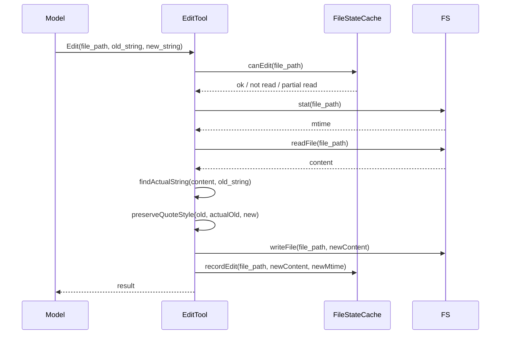

# EditTool 文档体系实现计划

> **For agentic workers:** REQUIRED SUB-SKILL: Use superpowers:subagent-driven-development (recommended) or superpowers:executing-plans to implement this plan task-by-task. Steps use checkbox (`- [ ]`) syntax for tracking.

**Goal:** 在 `docs/details/edit-tool/` 创建 8 个 Markdown 文档，完整分析当前 EditTool 的实现细节，形成技术参考手册。

**Architecture:** 以执行时序为主线，安全机制为副线，每个文档聚焦一个技术主题，文档之间通过相对链接引用，避免信息重复。

**Tech Stack:** Markdown, Mermaid 图表

---

### Task 1: 创建目录与执行时序文档

**Files:**
- Create: `docs/details/edit-tool/01-execution-flow.md`

- [ ] **Step 1: 创建目录**

```bash
mkdir -p docs/details/edit-tool
```

- [ ] **Step 2: 创建 01-execution-flow.md**

写入以下内容（基于 `src/agent/tools/edit.ts @ da24438`）：

```markdown
# EditTool 执行时序

> 分析对象：src/agent/tools/edit.ts @ da24438
> 日期：2026-04-24

---

## 概述

EditTool 是 ys-code 中用于**精确字符串替换**的文件编辑工具。一次完整的 Edit 调用经历两个阶段：`validateInput`（校验）和 `execute`（执行）。

```
模型发起 Edit
    |
    v
validateInput (第一层防线)
    |-- 先读后写检查 (错误码 6)
    |-- 脏写检测第一层 (错误码 7)
    |-- old_string === new_string (错误码 1)
    |-- 文件存在性检查 (错误码 3/4)
    |-- 字符串匹配检查 (错误码 8)
    |-- 多匹配检测 (错误码 9)
    v
execute (执行写入)
    |-- 二次脏写检测
    |-- 引号规范化
    |-- 字符串替换
    |-- 写入文件
    |-- 更新 FileStateCache
    v
返回结果
```

---

## validateInput 阶段

`validateInput` 在模型提出编辑请求后立即执行，是**第一道防线**。

### 1. 先读后写检查

```typescript
const readCheck = context.fileStateCache.canEdit(fullPath);
if (!readCheck.ok) {
  return { ok: false, message: readCheck.reason, errorCode: readCheck.errorCode };
}
```

- 检查文件是否已通过 ReadTool 读取
- 检查是否为部分读取（offset/limit/isPartialView）
- 错误码：`6`

### 2. 脏写检测第一层

```typescript
const stats = await stat(fullPath).catch(() => null);
if (stats && readCheck.record) {
  const currentMtime = Math.floor(stats.mtimeMs);
  if (currentMtime > readCheck.record.timestamp) {
    // 部分读取直接拒绝
    // 全量读取对比内容，内容变了才拒绝
  }
}
```

- 对比 mtime（快速）
- mtime 变了再对比 content（准确）
- 错误码：`7`

### 3. 无变化检查

```typescript
if (params.old_string === params.new_string) {
  return { ok: false, message: "No changes...", errorCode: 1 };
}
```

### 4. 文件存在性检查

- 文件不存在且 old_string 非空 → 错误码 `4`
- 文件不存在且 old_string 为空 → 允许（创建新文件）
- 文件存在但 old_string 为空 → 错误码 `3`

### 5. 字符串匹配检查（引号规范化）

```typescript
const actualOldString = findActualString(content, params.old_string);
if (!actualOldString) {
  return { ok: false, message: "String not found...", errorCode: 8 };
}
```

- 先精确匹配
- 失败则尝试引号规范化匹配

### 6. 多匹配检测

```typescript
const matches = content.split(actualOldString).length - 1;
if (matches > 1 && !params.replace_all) {
  return { ok: false, message: "Multiple matches...", errorCode: 9 };
}
```

---

## execute 阶段

`execute` 在 `validateInput` 通过后执行，是真正修改文件的阶段。

### 1. 二次脏写检测

```typescript
const record = context.fileStateCache.get(fullPath);
const stats = await stat(fullPath).catch(() => null);
if (stats && record) {
  const currentMtime = Math.floor(stats.mtimeMs);
  if (currentMtime > record.timestamp) {
    const isFullRead = record.offset === undefined && record.limit === undefined;
    const contentUnchanged = isFullRead && content === record.content;
    if (!contentUnchanged) {
      throw new Error('File unexpectedly modified since last read');
    }
  }
}
```

### 2. 引号规范化与替换

```typescript
const actualOldString = findActualString(content, old_string) || old_string;
const actualNewString = preserveQuoteStyle(old_string, actualOldString, new_string);
newContent = replace_all
  ? content.replaceAll(actualOldString, actualNewString)
  : content.replace(actualOldString, actualNewString);
```

### 3. 写入与缓存更新

```typescript
await writeFile(fullPath, newContent, "utf-8");
const newStats = await stat(fullPath);
context.fileStateCache.recordEdit(fullPath, newContent, Math.floor(newStats.mtimeMs));
```

---

## 两次脏写检测的时间点对比

```
T1: ReadTool 读取 → 记录 mtime=1000
    |
    v
T2: validateInput → 检查 mtime=1000（通过）
    |
    v
T3: （可能有用户确认间隙）
    |
    |-- 外部 Vim 修改 → mtime=2000
    |
    v
T4: execute → 再次检查 mtime=2000
    |           └── 发现 2000 > 1000
    |           └── 内容也变了
    |           └── 抛出错误
    |
    └── 没被修改 → 继续写入
```

---

## 与相关模块的交互

| 模块 | 交互方式 | 说明 |
|------|---------|------|
| ReadTool | FileStateCache | ReadTool 读取成功后调用 `recordRead()` |
| FileStateCache | validateInput/execute | EditTool 调用 `canEdit()` / `recordEdit()` |
| fs/promises | execute | 读取和写入文件 |
```

- [ ] **Step 3: 验证文件创建**

```bash
ls -la docs/details/edit-tool/01-execution-flow.md
```

Expected: 文件存在且内容完整

- [ ] **Step 4: Commit**

```bash
git add docs/details/edit-tool/
git commit -m "docs(edit-tool): add execution flow documentation"
```

---

### Task 2: 先读后写 + 脏写检测文档

**Files:**
- Create: `docs/details/edit-tool/02-read-before-write.md`
- Create: `docs/details/edit-tool/03-dirty-write-detection.md`

- [ ] **Step 1: 创建 02-read-before-write.md**

写入以下内容：

```markdown
# 先读后写（Read-before-Write）

> 分析对象：src/agent/file-state.ts @ da24438, src/agent/tools/edit.ts @ da24438

---

## 问题定义

模型在**未读取文件**的情况下直接发起编辑，可能导致：
- 基于过时记忆编辑文件，造成意外覆盖
- 编辑了错误的文件区域
- 无法感知文件已被外部修改

## 核心设计：读取凭证

FileStateCache 不是"缓存"，是**读取凭证 + 状态快照**。它存储的不是"文件内容"，而是"模型在某一刻看到的文件状态"。

```typescript
export interface FileReadRecord {
  content: string;      // 读取时的文件内容
  timestamp: number;    // 读取时的 mtime
  offset?: number;      // 部分读取起始行
  limit?: number;       // 部分读取行数
  isPartialView?: boolean;  // 是否为加工后的视图
}
```

## canEdit() 的三种返回状态

```typescript
canEdit(path: string):
  | { ok: true; record: FileReadRecord }
  | { ok: false; reason: string; errorCode: number }
```

| 状态 | 条件 | 错误码 | 恢复路径 |
|------|------|--------|---------|
| ok: true | 文件已全量读取 | - | 继续校验 |
| ok: false | 文件未读取 | 6 | 调用 ReadTool 读取 |
| ok: false | 部分读取 | 6 | 调用 ReadTool 全量读取 |

## 部分读取拒绝的理由

以下三种情况都视为"部分读取"，不允许编辑：

1. `isPartialView === true`：模型看到的是加工后的内容（如 CLAUDE.md 截断版）
2. `offset !== undefined`：只读取了文件的某一行之后的内容
3. `limit !== undefined`：只读取了限定行数

```typescript
if (record.isPartialView || record.offset !== undefined || record.limit !== undefined) {
  return { ok: false, reason: "File has only been partially read...", errorCode: 6 };
}
```

## 为什么不能用 Set<string> 记录"读过哪些文件"

如果只存 `Set<string>`：
- 不知道文件读取后是否被外部修改
- 不知道读取的是全量还是部分
- 不知道读取时的具体内容是什么

FileStateCache 存储的 `content` + `timestamp` 使得**脏写检测**成为可能。

## 错误恢复路径

当 EditTool 返回错误码 6 时，模型的正确恢复路径：
1. 调用 ReadTool 读取该文件（全量）
2. ReadTool 的 `execute` 中调用 `recordRead()`
3. 再次调用 EditTool，`canEdit()` 通过
```

- [ ] **Step 2: 创建 03-dirty-write-detection.md**

写入以下内容：

```markdown
# 脏写检测

> 分析对象：src/agent/tools/edit.ts @ da24438

---

## 问题定义

在 ReadTool 读取文件后、EditTool 写入文件前，文件可能被外部程序修改：
- 用户在 Vim/VSCode 中手动编辑
- linter 或 formatter 自动修改
- git 操作（如切换分支）

如果 EditTool 直接覆盖，这些外部修改将丢失。

## 双层检测架构

cc 的设计哲学：`validateInput` 到 `execute` 之间可能存在**用户确认间隙**（几秒到几十秒），因此需要两次检测。

### 第一层：validateInput

```typescript
const stats = await stat(fullPath).catch(() => null);
if (stats && readCheck.record) {
  const currentMtime = Math.floor(stats.mtimeMs);
  if (currentMtime > readCheck.record.timestamp) {
    // mtime 变了！
    const isFullRead = readCheck.record.offset === undefined && readCheck.record.limit === undefined;
    if (!isFullRead) {
      // 部分读取无法对比内容，直接拒绝
      return { ok: false, message: "File has been modified...", errorCode: 7 };
    }
    const content = await readFile(fullPath, 'utf-8').catch(() => null);
    if (content !== readCheck.record.content) {
      // 内容确实变了
      return { ok: false, message: "File has been modified...", errorCode: 7 };
    }
    // 内容没变，是误报（Windows 云同步等只改 mtime）
  }
}
```

**策略**：先比 mtime（快），mtime 没变则安全；mtime 变了再比 content（慢但准确）。

### 第二层：execute

```typescript
const record = context.fileStateCache.get(fullPath);
const stats = await stat(fullPath).catch(() => null);
if (stats && record) {
  const currentMtime = Math.floor(stats.mtimeMs);
  if (currentMtime > record.timestamp) {
    const isFullRead = record.offset === undefined && record.limit === undefined;
    const contentUnchanged = isFullRead && content === record.content;
    if (!contentUnchanged) {
      throw new Error('File unexpectedly modified since last read');
    }
  }
}
```

**关键区别**：第二层在真正写入前执行，使用**已经读取到的 content**（而非重新读取），避免异步操作被插入。

## 全量读取 vs 部分读取

| 场景 | 策略 | 原因 |
|------|------|------|
| 全量读取 | mtime 变了对比 content | 有完整内容可做回退对比 |
| 部分读取 | mtime 变了直接拒绝 | 不知道文件其余部分是否被修改 |

## 误报处理

某些场景下 mtime 会变但 content 不变：
- Windows 云同步工具（OneDrive、Dropbox）
- 杀毒软件扫描后重置时间戳
- `touch` 命令

全量读取时通过 content 对比排除误报；部分读取时保守拒绝。
```

- [ ] **Step 3: 验证文件创建**

```bash
ls docs/details/edit-tool/02-read-before-write.md docs/details/edit-tool/03-dirty-write-detection.md
```

- [ ] **Step 4: Commit**

```bash
git add docs/details/edit-tool/
git commit -m "docs(edit-tool): add read-before-write and dirty-write-detection docs"
```

---

### Task 3: 引号规范化文档

**Files:**
- Create: `docs/details/edit-tool/04-quote-normalization.md`

- [ ] **Step 1: 创建 04-quote-normalization.md**

写入以下内容（基于 `src/agent/tools/edit.ts` 顶部辅助函数）：

```markdown
# 引号规范化（Quote Normalization）

> 分析对象：src/agent/tools/edit.ts @ da24438

---

## 问题定义

模型输入的 `old_string` 通常使用 straight quotes（`"` 和 `'`），但实际文件可能使用 curly quotes（`"` `"` `'` `'`）。这会导致字符串匹配失败（错误码 8）。

**典型场景**：从 Word、网页复制的文本常包含 curly quotes。

## 核心常量

```typescript
const LEFT_SINGLE_CURLY_QUOTE = '‘'   // U+2018
const RIGHT_SINGLE_CURLY_QUOTE = '’'  // U+2019
const LEFT_DOUBLE_CURLY_QUOTE = '“'   // U+201C
const RIGHT_DOUBLE_CURLY_QUOTE = '”'  // U+201D
```

## normalizeQuotes

将所有 curly quotes 替换为对应的 straight quotes：

```typescript
function normalizeQuotes(str: string): string {
  return str
    .replaceAll(LEFT_SINGLE_CURLY_QUOTE, "'")
    .replaceAll(RIGHT_SINGLE_CURLY_QUOTE, "'")
    .replaceAll(LEFT_DOUBLE_CURLY_QUOTE, '"')
    .replaceAll(RIGHT_DOUBLE_CURLY_QUOTE, '"')
}
```

## findActualString

先在文件中精确匹配，失败则尝试规范化匹配：

```typescript
function findActualString(fileContent: string, searchString: string): string | null {
  if (fileContent.includes(searchString)) {
    return searchString  // 精确匹配成功
  }
  
  const normalizedSearch = normalizeQuotes(searchString)
  const normalizedFile = normalizeQuotes(fileContent)
  const searchIndex = normalizedFile.indexOf(normalizedSearch)
  
  if (searchIndex !== -1) {
    // 规范化匹配成功，返回文件中实际存在的字符串
    return fileContent.substring(searchIndex, searchIndex + searchString.length)
  }
  
  return null
}
```

## preserveQuoteStyle

如果匹配成功是因为 curly quotes，将 `new_string` 中的对应引号也转换为 curly quotes，保持文件原有排版风格。

```typescript
function preserveQuoteStyle(
  oldString: string,
  actualOldString: string,
  newString: string,
): string {
  if (oldString === actualOldString) return newString  // 无规范化发生
  
  const hasDoubleQuotes = actualOldString.includes(LEFT_DOUBLE_CURLY_QUOTE)
    || actualOldString.includes(RIGHT_DOUBLE_CURLY_QUOTE)
  const hasSingleQuotes = actualOldString.includes(LEFT_SINGLE_CURLY_QUOTE)
    || actualOldString.includes(RIGHT_SINGLE_CURLY_QUOTE)
  
  if (!hasDoubleQuotes && !hasSingleQuotes) return newString
  
  let result = newString
  if (hasDoubleQuotes) result = applyCurlyDoubleQuotes(result)
  if (hasSingleQuotes) result = applyCurlySingleQuotes(result)
  return result
}
```

## 引号方向判断

使用简单的上下文启发式规则判断引号是"开"还是"闭"：

```typescript
function isOpeningContext(chars: string[], index: number): boolean {
  if (index === 0) return true
  const prev = chars[index - 1]
  return /\s|[([{—–]/.test(prev)  // 空白或开括号前为开引号
}
```

## 单引号的特殊处理：Apostrophe

英语中的缩略形式（don't、it's）使用 right single curly quote 而非 straight quote：

```typescript
// 在 applyCurlySingleQuotes 中
const prevIsLetter = prev !== undefined && /\p{L}/u.test(prev)
const nextIsLetter = next !== undefined && /\p{L}/u.test(next)
if (prevIsLetter && nextIsLetter) {
  result.push(RIGHT_SINGLE_CURLY_QUOTE)  // apostrophe
} else {
  result.push(isOpeningContext(chars, i) ? LEFT_SINGLE_CURLY_QUOTE : RIGHT_SINGLE_CURLY_QUOTE)
}
```

## 为什么返回 actualOldString 但 newString 保持不变

- `oldString` 返回 `actualOldString`（文件中的实际字符串）
- `newString` 返回原始的 `new_string`（模型输入的 straight quotes）

这样设计的原因是：
1. 模型看到的内容是它自己输入的，不会产生困惑
2. 文件被正确写入了 `actualNewString`（带 curly quotes）
3. 保持了模型与文件排版风格的隔离

## 执行流程中的位置

```typescript
const actualOldString = findActualString(content, old_string) || old_string
const actualNewString = preserveQuoteStyle(old_string, actualOldString, new_string)
newContent = replace_all
  ? content.replaceAll(actualOldString, actualNewString)
  : content.replace(actualOldString, actualNewString)
```
```

- [ ] **Step 2: 验证文件创建**

```bash
ls docs/details/edit-tool/04-quote-normalization.md
```

- [ ] **Step 3: Commit**

```bash
git add docs/details/edit-tool/
git commit -m "docs(edit-tool): add quote normalization documentation"
```

---

### Task 4: FileStateCache 文档

**Files:**
- Create: `docs/details/edit-tool/05-file-state-cache.md`

- [ ] **Step 1: 创建 05-file-state-cache.md**

写入以下内容（基于 `src/agent/file-state.ts`）：

```markdown
# FileStateCache

> 分析对象：src/agent/file-state.ts @ da24438

---

## 概述

FileStateCache 是基于 LRUCache 的文件读取状态管理器。它存储的不是"文件缓存"，而是**读取凭证 + 状态快照**，用于：
1. 强制先读后写（Read-before-Write）
2. 脏写检测（Dirty-write Detection）
3. 编辑后可持续编辑（无需重新读取）

## 数据结构

### FileReadRecord

```typescript
export interface FileReadRecord {
  /** 读取时的文件内容（用于后续内容对比，防止时间戳误报） */
  content: string;
  /** 读取时的文件修改时间（fs.stat().mtimeMs） */
  timestamp: number;
  /** 部分读取时的起始行号（1-based，全量读取为 undefined） */
  offset?: number;
  /** 部分读取时的行数限制（全量读取为 undefined） */
  limit?: number;
  /** 是否为部分视图（如 CLAUDE.md 自动注入的内容） */
  isPartialView?: boolean;
}
```

| 字段 | 作用 | 缺失后果 |
|------|------|---------|
| content | 内容回退对比 | Windows 云同步改 mtime 误报；编辑后可持续编辑 |
| timestamp | 脏写检测基准 | 不知道"读取后文件是否被改过" |
| offset/limit | 区分部分/全量读取 | 部分读取后 mtime 变了，不知该放行还是拦截 |
| isPartialView | 拒绝加工后的内容 | 模型看到截断版也允许编辑，危险 |

## LRU 策略

```typescript
constructor(options?: { maxEntries?: number; maxSizeBytes?: number }) {
  this.cache = new LRUCache<string, FileReadRecord>({
    max: options?.maxEntries ?? 100,           // 最多 100 个文件
    maxSize: options?.maxSizeBytes ?? 25 * 1024 * 1024,  // 最多 25MB
    sizeCalculation: (value) => Math.max(1, Buffer.byteLength(value.content)),
  });
}
```

- **maxEntries**：按条目数限制，防止路径爆炸
- **maxSizeBytes**：按内容字节数限制，防止大文件撑爆内存
- **sizeCalculation**：以 `content` 的字节数计算每条记录的"大小"

## 接口方法

### recordRead

```typescript
recordRead(path, content, timestamp, offset?, limit?, isPartialView?): void
```

- 规范化路径（`normalize(path)`）
- `isPartialView` 默认 `false`
- 覆盖同一文件的旧记录

### canEdit

```typescript
canEdit(path):
  | { ok: true; record: FileReadRecord }
  | { ok: false; reason: string; errorCode: number }
```

- 检查文件是否已读取
- 检查是否为部分读取（`isPartialView || offset !== undefined || limit !== undefined`）
- 错误码统一为 `6`

### recordEdit

```typescript
recordEdit(path, newContent, newTimestamp): void
```

- 编辑成功后调用
- `offset` 和 `limit` 清空为 `undefined`
- `isPartialView` 强制为 `false`
- 这意味着刚编辑完的文件**不需要重新 Read** 就能再次 Edit

### get / clear

```typescript
get(path): FileReadRecord | undefined
clear(): void
```

## 为什么用 LRU 而不是 Map

| 特性 | Map | LRUCache |
|------|-----|----------|
| 内存保护 | 无，无限增长 | 有，按条目数 + 大小限制 |
| 淘汰策略 | 无 | 最近最少使用 |
| 大小计算 | 无 | 自定义 sizeCalculation |
| 并发安全 | 单线程安全 | 单线程安全 |

**结论**：Map 在长时间运行的 Agent 会话中可能导致内存泄漏（读取大量文件后）。LRU 自动淘汰旧记录，适合 Agent 场景。

## 与 cc 的对比

cc 的 `FileStateCache` 同样基于 LRUCache，参数一致（100 条目 / 25MB）。ys-code 的设计直接复用了这一策略，但实现更轻量（无 dump/load 持久化接口）。
```

- [ ] **Step 2: 验证文件创建**

```bash
ls docs/details/edit-tool/05-file-state-cache.md
```

- [ ] **Step 3: Commit**

```bash
git add docs/details/edit-tool/
git commit -m "docs(edit-tool): add FileStateCache documentation"
```

---

### Task 5: 错误处理 + 测试文档

**Files:**
- Create: `docs/details/edit-tool/06-error-handling.md`
- Create: `docs/details/edit-tool/07-testing.md`

- [ ] **Step 1: 创建 06-error-handling.md**

写入以下内容：

```markdown
# 错误处理

> 分析对象：src/agent/tools/edit.ts @ da24438

---

## 错误码对照表

| 错误码 | 触发场景 | 消息示例 | 恢复路径 |
|--------|---------|---------|---------|
| 1 | `old_string === new_string` | "No changes to make..." | 检查输入是否有变化 |
| 3 | 文件存在但 `old_string` 为空 | "Cannot create new file..." | 使用 WriteTool 或提供 old_string |
| 4 | 文件不存在且 `old_string` 非空 | "File does not exist..." | 使用 WriteTool 创建文件 |
| 6 | 文件未读取或部分读取 | "File has not been read yet..." | 调用 ReadTool 读取 |
| 7 | 文件在读取后被外部修改 | "File has been modified since read..." | 调用 ReadTool 重新读取 |
| 8 | `old_string` 找不到 | "String to replace not found..." | 检查 old_string 是否正确 |
| 9 | 多匹配但 `replace_all=false` | "Found N matches..." | 扩大上下文或启用 replace_all |

## 新增错误码决策记录

### 为什么用 6 和 7

沿用 cc 的错误码体系，避免冲突：
- 错误码 6：文件未读取 / 部分读取
- 错误码 7：文件被外部修改

这两个错误码在 cc 中已存在，ys-code 直接复用以保持语义一致。

### 为什么未引入 2/5/10

| 错误码 | cc 用途 | ys-code 未引入原因 |
|--------|---------|-------------------|
| 2 | 权限规则 deny | 当前无权限系统 |
| 5 | Jupyter Notebook | 当前无 NotebookEditTool |
| 10 | 文件超过 1GB | 当前无文件大小限制 |

## 错误恢复路径

### 错误码 6 的恢复

```
EditTool 返回错误码 6
    |
    v
模型调用 ReadTool 读取该文件（全量）
    |
    v
ReadTool.execute 中调用 recordRead()
    |
    v
模型再次调用 EditTool
    |
    v
canEdit() 通过
```

### 错误码 7 的恢复

与错误码 6 类似，但 ReadTool 读取的是**最新内容**（外部修改后的）。

### 错误码 8/9 的恢复

- 错误码 8：检查 `old_string` 是否与文件内容完全匹配（包括空格、缩进）
- 错误码 9：扩大 `old_string` 的上下文范围，使其唯一；或设置 `replace_all: true`
```

- [ ] **Step 2: 创建 07-testing.md**

写入以下内容：

```markdown
# 测试覆盖

> 分析对象：src/agent/file-state.test.ts @ da24438, src/agent/tools/edit.test.ts @ da24438

---

## 测试矩阵

### FileStateCache 测试（16 个）

| 测试名 | 覆盖场景 |
|--------|---------|
| 全量读取后应允许编辑 | canEdit 返回 ok: true |
| 未读取文件应拒绝编辑 | canEdit 返回 errorCode: 6 |
| 部分视图应拒绝编辑 | isPartialView=true 时拒绝 |
| 部分读取（offset 有值）应拒绝编辑 | offset !== undefined 时拒绝 |
| 部分读取（limit 有值）应拒绝编辑 | limit !== undefined 时拒绝 |
| 编辑后应更新记录 | recordEdit 更新 content/timestamp/offset/limit |
| 编辑后连续编辑无需重新读取 | recordEdit 后 canEdit 直接通过 |
| 路径应规范化 | normalize(path) 生效 |
| LRU 应自动淘汰旧项 | maxEntries 限制生效 |
| LRU 按大小淘汰 | maxSizeBytes + sizeCalculation 生效 |
| clear() 清除所有记录 | clear 后 get/canEdit 均失效 |
| get() 获取未记录文件返回 undefined | 未缓存路径 |
| 多次读取同一文件覆盖更新 | 后写入的覆盖先写入的 |
| recordRead 默认值检查 | isPartialView=false, offset/limit=undefined |
| canEdit 返回的 record 完整性 | 返回 record 包含全部字段 |
| recordEdit 后 isPartialView 强制为 false | 覆盖之前可能的 true |

### EditTool 集成测试（6 个）

| 测试名 | 覆盖场景 |
|--------|---------|
| 未读取文件应拒绝编辑 | validateInput 返回 errorCode: 6 |
| 读取后应允许编辑 | validateInput 返回 ok: true |
| 编辑后应更新缓存 | execute 中调用 recordEdit |
| curly quotes 匹配 | findActualString 规范化匹配 |
| curly quotes 风格保留 | preserveQuoteStyle 生效 |
| straight quotes 回退 | 无 curly quotes 时正常处理 |

## 未覆盖场景

| 场景 | 未覆盖原因 | 风险等级 |
|------|-----------|---------|
| 脏写检测触发（错误码 7） | 需要操作文件 mtime，测试复杂 | 低（逻辑简单，有源码验证） |
| 二次脏写检测抛出异常 | 同上 | 低 |
| replace_all=true 多替换 | 逻辑简单，有源码验证 | 低 |
| 文件不存在创建（old_string=""） | 基础功能，有源码验证 | 低 |

## 测试设计原则

1. **纯逻辑测试**：FileStateCache 测试完全 mock，无文件系统依赖
2. **集成测试**：EditTool 测试使用临时文件，覆盖完整调用链路
3. **边界覆盖**：部分读取、LRU 淘汰、默认值等边界场景均有覆盖
```

- [ ] **Step 3: 验证文件创建**

```bash
ls docs/details/edit-tool/06-error-handling.md docs/details/edit-tool/07-testing.md
```

- [ ] **Step 4: Commit**

```bash
git add docs/details/edit-tool/
git commit -m "docs(edit-tool): add error-handling and testing documentation"
```

---

### Task 6: cc 对比 + README

**Files:**
- Create: `docs/details/edit-tool/08-cc-comparison.md`
- Create: `docs/details/edit-tool/README.md`

- [ ] **Step 1: 创建 08-cc-comparison.md**

写入以下内容（基于 `docs/cc/2026-04-23-cc-EditTool-源码分析.md` 和实现决策）：

```markdown
# 与 claude-code-haha 的差异对比

> 来源：docs/cc/2026-04-23-cc-EditTool-源码分析.md
> 日期：2026-04-24

---

## 功能对齐度

| 功能 | cc | ys-code | 状态 |
|------|-----|---------|------|
| 先读后写 | ✅ | ✅ | **已对齐** |
| 脏写检测（双层） | ✅ | ✅ | **已对齐** |
| 引号规范化 | ✅ | ✅ | **已对齐** |
| FileStateCache (LRU) | ✅ | ✅ | **已对齐** |
| 错误码体系 | 0-10 | 1,3,4,6,7,8,9 | 部分对齐 |
| LSP 诊断通知 | ✅ | ❌ | 未实现 |
| 文件历史备份 | ✅ | ❌ | 未实现 |
| settings 文件校验 | ✅ | ❌ | 未实现 |
| Notebook 保护 | ✅ | ❌ | 未实现 |
| 权限系统 | ✅ | ❌ | 未实现 |
| UNC 路径安全 | ✅ | ❌ | 未实现 |
| 团队内存 secrets 检查 | ✅ | ❌ | 未实现 |

## 已引入机制的决策记录

### 为什么选择 LRUCache 而不是 Map

**选项 A：Map（轻量级）**
- 优点：无额外依赖，代码简单
- 缺点：无内存上限，长时间运行可能 OOM

**选项 B：LRUCache（cc 同款）**
- 优点：内存受限，自动淘汰，与 cc 对齐
- 缺点：需要 `lru-cache` 依赖

**决策**：选择 LRUCache。Agent 会话可能持续数小时，读取数百个文件，Map 会导致内存泄漏。

### 为什么使用 ToolUseContext 注入 FileStateCache

**选项 A：工厂参数注入（早期设计）**
- `session.ts` 创建 tracker，通过工厂函数参数传给 ReadTool/EditTool
- 优点：修改面小，只改 3 个文件
- 缺点：子 Agent 无法共享读取记录

**选项 B：ToolUseContext 注入（最终设计）**
- FileStateCache 放入 `ToolUseContext`，所有工具共享
- 优点：子 Agent 可继承，与 cc 的 `toolUseContext.readFileState` 对齐
- 缺点：需要修改 `defineAgentTool` 和 `AgentLoopConfig`

**决策**：选择 ToolUseContext 注入。为后续子 Agent 共享状态预留空间。

### 为什么 errorCode 用 6 和 7

直接沿用 cc 的错误码体系，保持语义一致：
- 6 = 文件未读取（cc 同款）
- 7 = 文件被修改（cc 同款）

这样当模型从 cc 迁移到 ys-code 时，对错误码的理解不变。

## 尚未引入的机制

### LSP 通知
cc 在编辑后通知 LSP 服务器更新诊断：
```typescript
lspManager.changeFile(absoluteFilePath, updatedFile).catch(...)
lspManager.saveFile(absoluteFilePath).catch(...)
```
ys-code 当前无 LSP 集成，暂不需要。

### 文件历史备份
c 在编辑前备份文件历史，支持恢复：
```typescript
await fileHistoryTrackEdit(updateFileHistoryState, absoluteFilePath, parentMessage.uuid)
```
ys-code 当前依赖 git 做版本控制，暂不需要内置备份。

### Notebook 保护
c 禁止直接编辑 `.ipynb` 文件：
```typescript
if (fullFilePath.endsWith('.ipynb')) {
  return { result: false, message: 'Use NotebookEditTool', errorCode: 5 }
}
```
ys-code 当前无 NotebookEditTool，暂不需要。

## 演进方向

高优先级：
1. 脏写检测的集成测试（需要文件系统时间操作）
2. WriteTool 的覆盖检查（覆盖已有文件时要求先读取）

中优先级：
1. 文件大小限制（1GB 防 OOM）
2. settings 文件特殊校验

低优先级：
1. LSP 通知集成
2. 文件历史备份
```

- [ ] **Step 2: 创建 README.md**

写入以下内容：

```markdown
# EditTool 技术文档

> 分析对象：src/agent/tools/edit.ts @ da24438, src/agent/file-state.ts @ da24438
> 日期：2026-04-24

---

## 一句话定义

EditTool 是 ys-code 中用于**精确字符串替换**的文件编辑工具，具备先读后写、脏写检测、引号规范化三大安全机制。

## 架构图



## 文档索引

| 文档 | 内容 | 一句话摘要 |
|------|------|-----------|
| [01-execution-flow](./01-execution-flow.md) | 完整执行时序 | validateInput → execute 的完整链路 |
| [02-read-before-write](./02-read-before-write.md) | 先读后写机制 | 为什么必须先 Read 才能 Edit |
| [03-dirty-write-detection](./03-dirty-write-detection.md) | 脏写检测 | 双层检测防止外部修改覆盖 |
| [04-quote-normalization](./04-quote-normalization.md) | 引号规范化 | curly quotes 匹配与风格保留 |
| [05-file-state-cache](./05-file-state-cache.md) | FileStateCache | LRU 缓存设计与读取凭证模型 |
| [06-error-handling](./06-error-handling.md) | 错误码体系 | 7 个错误码的触发条件与恢复路径 |
| [07-testing](./07-testing.md) | 测试覆盖 | 22 个测试的覆盖矩阵与未覆盖场景 |
| [08-cc-comparison](./08-cc-comparison.md) | cc 差异对比 | 功能对齐度与演进决策记录 |

## 相关外部文档

| 文档 | 位置 | 说明 |
|------|------|------|
| cc EditTool 源码分析 | `docs/cc/2026-04-23-cc-EditTool-源码分析.md` | cc 的完整时序分析 |
| cc 对比 | `docs/cc/edit-tool-comparison.md` | 早期对比文档 |
| 演进设计 | `docs/plan/2026-04-23-read-before-write-design.md` | 先读后写机制设计 |
| 演进 Spec | `docs/superpowers/specs/2026-04-23-edittool-evolution-design.md` | 演进方案设计 |

## 维护约定

- 源码变更时优先更新 [01-execution-flow](./01-execution-flow.md)
- 新增安全机制时按编号规则新增文档（如 `02x-xxx.md`）
- [08-cc-comparison](./08-cc-comparison.md) 仅在做出新的对齐/差异决策时更新
- 文档之间通过相对链接引用，避免信息重复
```

- [ ] **Step 3: 验证所有文档创建**

```bash
ls docs/details/edit-tool/
```

Expected: 8 个文件全部存在

- [ ] **Step 4: Commit**

```bash
git add docs/details/edit-tool/
git commit -m "docs(edit-tool): add cc comparison and README"
```

---

## Self-Review

### 1. Spec coverage

设计文档中的 8 个文件全部有对应的 Task：
- README.md → Task 6
- 01-execution-flow.md → Task 1
- 02-read-before-write.md → Task 2
- 03-dirty-write-detection.md → Task 2
- 04-quote-normalization.md → Task 3
- 05-file-state-cache.md → Task 4
- 06-error-handling.md → Task 5
- 07-testing.md → Task 5
- 08-cc-comparison.md → Task 6

### 2. Placeholder scan

无 TBD、TODO、"implement later"。每个文档的完整 Markdown 内容已在计划中提供。

### 3. Type consistency

不适用（文档工程，无代码类型）。

---

## Execution Handoff

**Plan complete and saved to `docs/superpowers/plans/2026-04-24-edit-tool-documentation.md`.**

**Two execution options:**

**1. Subagent-Driven (recommended)** - I dispatch a fresh subagent per task, review between tasks, fast iteration

**2. Inline Execution** - Execute tasks in this session using executing-plans, batch execution with checkpoints

**Which approach?**
