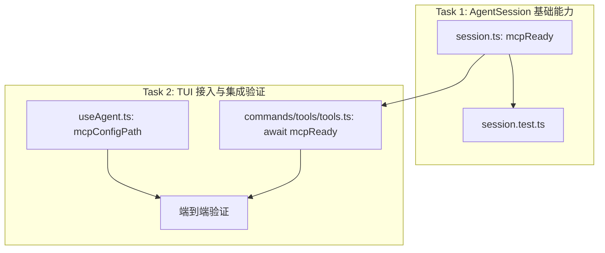

# TUI 启用 MCP Client 支持 — 实现计划

| 字段       | 值                                      |
|------------|----------------------------------------|
| 创建日期   | 2026-05-13                             |
| 分支       | `feat/mcp-client`                      |
| Spec       | `docs/ys-powers/specs/2026-05-13-enable-mcp-in-tui-design.md` |

---

## 1. 依赖图



**核心依赖**：Task 2 依赖 Task 1 的 `mcpReady()` API。

---

## 2. 垂直切片任务

### Task 1: AgentSession 暴露 mcpReady()

**目标**：让 `AgentSession` 对外暴露等待 MCP 初始化的能力，并保证单元测试覆盖。

**涉及文件**：
- `src/agent/session.ts` — 新增 `mcpReady()` 方法
- `src/agent/session.test.ts` — 补充单元测试

**验收标准**：
1. `mcpReady()` 在 `mcpInitPromise` 存在时 await 它，否则立即 resolve
2. `mcpReady()` 可被外部调用（如 `/tools` command）
3. 测试覆盖：
   - 未配置 MCP 时 `mcpReady()` 立即 resolve
   - 配置 MCP 时 `mcpReady()` 等待 `initializeMcpTools` 完成
   - MCP 加载完成后 `session.tools` 包含 MCP tools

**验证步骤**：
```bash
bun test src/agent/session.test.ts
```

---

### Checkpoint 1

- [ ] `mcpReady()` API 可用且行为正确
- [ ] 单元测试通过
- [ ] 不引入 breaking change

---

### Task 2: TUI 接入与 /tools 集成

**目标**：在 TUI 层启用 MCP，并确保 `/tools` 命令展示完整 tools 列表。

**涉及文件**：
- `src/tui/hooks/useAgent.ts` — 传入 `mcpConfigPath`
- `src/commands/tools/tools.ts` — 等待 `mcpReady()` 后读取 tools

**验收标准**：
1. `useAgent` 创建的 `AgentSession` 自动传入 `mcpConfigPath: process.cwd()`
2. `/tools` 命令在 MCP 加载完成前调用时等待，不返回不完整列表
3. 端到端验证：启动 TUI 后输入 `/tools`，输出包含 `mcp__{server}__{tool}`

**验证步骤**：
```bash
# 1. 准备 .mcp.json（echo server）
# 2. 启动 TUI
bun run src/main.ts
# 3. 输入 /tools，确认输出包含 mcp__echo__echo
```

---

### Checkpoint 2

- [ ] TUI 启动时自动加载 `.mcp.json`
- [ ] `/tools` 正确展示 MCP tools
- [ ] MCP 连接失败不阻断 TUI
- [ ] `bun test src/` 全量通过（除既有失败外）
- [ ] `bun run check` 无类型错误

---

## 3. 时间估算

| Task | 预估工作量 | 说明 |
|------|-----------|------|
| Task 1 | 0.5 h | API 新增 + 测试覆盖 |
| Task 2 | 0.5 h | 两处接入 + 端到端验证 |
| **总计** | **~1 h** | 含 review 和调试缓冲 |

---

## 4. 风险与应对

| 风险 | 影响 | 应对 |
|------|------|------|
| `mcpInitPromise` 在 `prompt()` 中被清空，导致 `/tools` 调用时无 promise 可等 | `/tools` 可能看不到 MCP tools | `mcpReady()` 中判断 `mcpInitPromise` 是否存在，不存在则检查是否已加载过 |
| MCP 连接超时（10s）导致 `/tools` 卡顿 | 用户体验 | 已在 connection.ts 中实现 10s 超时，超时后 reject，`mcpReady()` 不会无限阻塞 |
| TUI 层未传 `mcpConfigPath` 导致功能不生效 | 功能不可用 | 验收标准 3 强制端到端验证 |

---

## 5. 立即开始的下一步

1. 用户确认本 plan。
2. 进入 `/build` 模式，按 Task 1 → Task 2 顺序执行。
3. 每个 Task 遵循 TDD：先写测试 → 实现 → 运行验证 → commit → 进入 checkpoint。
