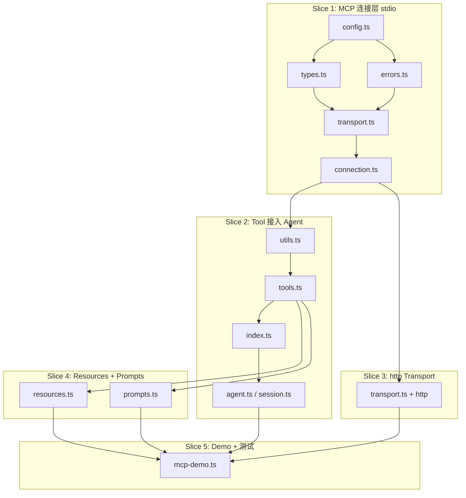

# ys-code MCP Client 集成 — 实现计划

| 字段       | 值                                      |
|------------|----------------------------------------|
| 创建日期   | 2026-05-13                             |
| 分支       | `feat/mcp-client`                      |
| Spec       | `docs/ys-powers/specs/2026-05-13-mcp-client-integration-design.md` |

---

## 1. 依赖图



**核心依赖关系**：
- `types.ts` / `errors.ts` 被所有 slice 依赖（最先完成）。
- `config.ts` 不依赖其他 slice，可独立开发。
- `transport.ts` 依赖 `types.ts`，`connection.ts` 依赖 `transport.ts`。
- `tools.ts` 依赖 `connection.ts`（需要 `tools/list` 结果）和 `utils.ts`（schema 转换）。
- `resources.ts` / `prompts.ts` 依赖 `connection.ts` 和 `tools.ts` 的 namespacing 模式。
- `index.ts` 依赖 `connection.ts` + `tools.ts` + `resources.ts` + `prompts.ts`。
- `agent.ts` / `session.ts` 改动依赖 `index.ts`。
- `mcp-demo.ts` 依赖 `session.ts` 的最终形态。

---

## 2. 垂直切片任务

### Slice 1: MCP 连接层（stdio）

**目标**：能读取 `.mcp.json`，建立 stdio transport 连接，完成 MCP handshake，fetch 原始 `tools/list`。

**涉及文件**：
- `src/mcp/types.ts` — 内部类型（`McpServerConfig`, `McpTransport`, `McpServerState`）
- `src/mcp/errors.ts` — 错误类（`McpConnectionError`, `McpConfigError`）
- `src/mcp/config.ts` — 读取 `cwd/.mcp.json`，校验，env 展开
- `src/mcp/transport.ts` — `McpTransport` 接口 + stdio 实现
- `src/mcp/connection.ts` — `McpConnectionManager.connect()`，handshake，capability 检测

**验收标准**：
1. `config.test.ts` 通过：能解析示例 `.mcp.json`，字段缺失时报 `McpConfigError`。
2. 一个临时测试脚本（不提交）能：
   - 读取 `examples/debug/test-mcp.json`
   - 通过 `McpConnectionManager` 连接 `@modelcontextprotocol/server-filesystem`
   - `initialize` handshake 成功
   - `tools/list` 返回非空数组
3. stdio 子进程在测试结束或连接断开时被正确 kill。

**验证步骤**：
```bash
bun test src/mcp/config.test.ts
# 临时脚本验证 handshake
bun run scripts/test-slice1.ts
```

---

### Checkpoint 1

- [ ] Slice 1 代码 review 通过
- [ ] 能手动跑通 stdio handshake + tools/list
- [ ] 确认 `@modelcontextprotocol/sdk` 的 `Client` / `StdioClientTransport` API 使用正确

---

### Slice 2: MCP Tool 接入 Agent（stdio 端到端）

**目标**：把 MCP server 返回的 tools 转换为 `AgentTool`，注册到 Agent，让 agent loop 能实际调用。

**涉及文件**：
- `src/mcp/utils.ts` — `jsonSchemaToTypeBox()`，fallback 到 `Type.Any()`
- `src/mcp/tools.ts` — `createMcpToolAdapter()`：包装 name/description/parameters/execute
- `src/mcp/index.ts` — `loadMcpServers()`：配置 → 连接 → 转换 → 返回 `AgentTool[]`
- `src/agent/session.ts` — 在构造函数中可选调用 `loadMcpServers()` 并合并 tools
- `src/agent/agent.ts` — 如有必要，调整工具注册时序

**验收标准**：
1. `utils.test.ts` 通过：JSON Schema（object/string/number/boolean/array/enum/required）→ TypeBox 转换正确；不支持的 schema 降级为 `Type.Any()` 并触发 warn。
2. `tools.test.ts` 通过：namespacing 正确（`mcp__filesystem__list_directory`），参数传递正确。
3. 修改后的 `AgentSession` 在传入 `mcpConfigPath` 时能自动加载 MCP tools。
4. 一个测试脚本能：创建 `AgentSession` → prompt "列出当前目录文件" → agent 调用 MCP `list_directory` → 返回结果正确。

**验证步骤**：
```bash
bun test src/mcp/utils.test.ts src/mcp/tools.test.ts
bun run scripts/test-slice2.ts
```

---

### Checkpoint 2

- [ ] Slice 2 代码 review 通过
- [ ] 手动验证：agent 成功调用至少一个 MCP tool
- [ ] schema 转换边缘 case 已覆盖（anyOf, nested object, enum）

---

### Slice 3: http Transport

**目标**：在 transport 层增加 streamable HTTP 支持，让 http MCP server 也能连接。

**涉及文件**：
- `src/mcp/transport.ts` — 增加 `StreamableHTTPClientTransport` 封装

**验收标准**：
1. 同一个 `McpConnectionManager` 既能连 stdio server 也能连 http server。
2. http server 的 `tools/list` 和 `tools/call` 行为与 stdio 一致。
3. 连接超时 10s，调用超时 30s。

**验证步骤**：
```bash
# 启动一个本地 http MCP server（如官方示例）
npx @modelcontextprotocol/server-echo &
# 运行测试脚本
bun run scripts/test-slice3.ts
```

---

### Checkpoint 3

- [ ] http handshake 与 tool call 手动验证通过
- [ ] 超时行为符合预期（连接慢/调用慢时正确报错）

---

### Slice 4: Resources + Prompts

**目标**：为每个已连接 server 提供内置 agent tools，让 LLM 能 list/read resources 和 list/get prompts。

**涉及文件**：
- `src/mcp/resources.ts` — `createMcpListResourcesTool()`, `createMcpReadResourceTool()`
- `src/mcp/prompts.ts` — `createMcpListPromptsTool()`, `createMcpGetPromptTool()`
- `src/mcp/index.ts` — `loadMcpServers()` 返回的 AgentTool[] 包含 resource/prompt 工具

**验收标准**：
1. 对只支持 tools 不支持 resources 的 server，不注册 resource/prompt 工具（capability 检测）。
2. `list_resources` 工具返回该 server 的 resource URI 列表。
3. `read_resource` 工具能读取指定 URI 的内容。
4. `list_prompts` / `get_prompt` 同理。

**验证步骤**：
```bash
bun test src/mcp/resources.test.ts src/mcp/prompts.test.ts
bun run scripts/test-slice4.ts
```

---

### Checkpoint 4

- [ ] resource/prompt 工具手动验证通过
- [ ] capability 检测逻辑正确（不支持 resources 的 server 不报错）

---

### Slice 5: Demo + 全量测试补全

**目标**：提供独立可运行的 demo，补全所有单元测试，确保全量 `bun test` 通过。

**涉及文件**：
- `examples/debug/mcp-demo.ts` — 独立 demo
- `src/mcp/config.test.ts` — 补全（若 slice 1 已写则补充 edge case）
- `src/mcp/connection.test.ts` — mock transport，测试状态转换
- `src/mcp/tools.test.ts` — 补全 execute 调用链路

**验收标准**：
1. `bun run examples/debug/mcp-demo.ts` 一键运行，输出清晰的执行日志和最终结果。
2. `bun test` 全量通过（含新增和既有测试）。
3. `bun run build` 或 `bun run check` 无类型错误。
4. demo 文档（代码内注释）说明：如何准备 `.mcp.json`、如何运行、期望输出。

**验证步骤**：
```bash
# 1. 准备 .mcp.json（demo 自动创建或读取现有）
# 2. 运行 demo
bun run examples/debug/mcp-demo.ts
# 3. 全量测试
bun test
# 4. 类型检查
bun run check
```

---

## 3. 风险与应对

| 风险 | 影响 | 应对 |
|------|------|------|
| JSON Schema → TypeBox 转换复杂度高 | Slice 2 延期 | 优先实现常见类型（object/string/number/boolean/array/enum/required），复杂类型 fallback 到 `Type.Any()` |
| `@modelcontextprotocol/sdk` API 与调研文档有差异 | Slice 1 阻塞 | Slice 1 的 checkpoint 专门验证 SDK API 用法 |
| Agent loop 对动态工具的支持有隐藏限制 | Slice 2 阻塞 | Slice 2 先做最小工具接入验证（1 个 tool），再批量注册 |
| http transport 需要本地 server 做测试 | Slice 3 验证困难 | 使用官方 `@modelcontextprotocol/server-echo` 或手写简单 HTTP server 做 fixture |

---

## 4. 时间估算

| Slice | 预估工作量 | 说明 |
|-------|-----------|------|
| Slice 1 | 0.5 d | SDK API 熟悉 + 配置读取 + stdio transport |
| Slice 2 | 1 d | schema 转换是主要工作量 |
| Slice 3 | 0.5 d | http transport 逻辑相对标准 |
| Slice 4 | 0.5 d | 复用 Slice 2 的 tool 包装模式 |
| Slice 5 | 0.5 d | demo + 测试补全 |
| **总计** | **~3 d** | 含 review 和调试缓冲 |

---

## 5. 立即开始的下一步

1. **用户确认本 plan**。
2. 进入 `/build` 模式，按 Slice 1 → Slice 5 顺序执行。
3. 每个 Slice 遵循 TDD：先写测试 → 实现 → 运行验证 → commit → 进入 checkpoint。
