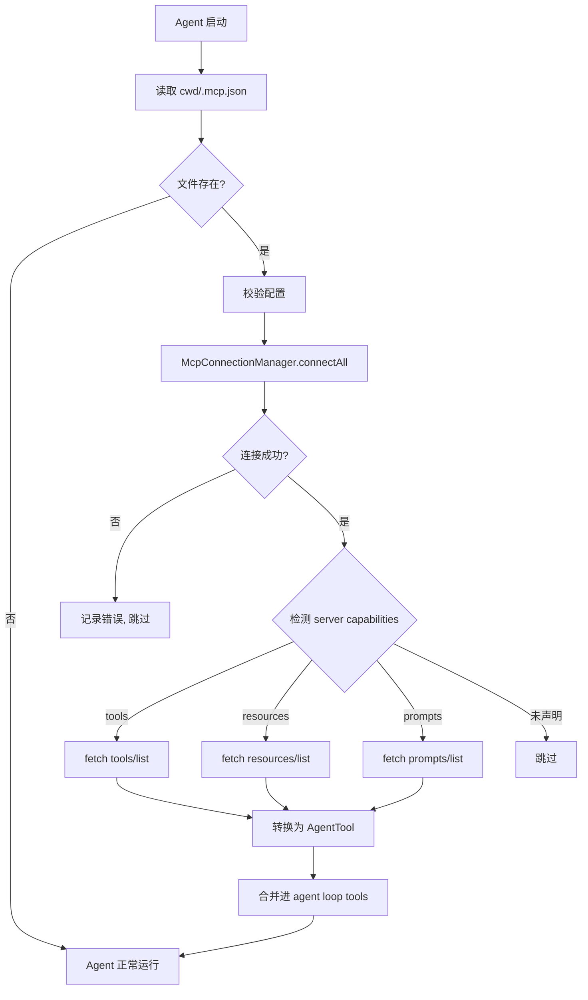

# ys-code MCP Client 集成 — Spec

| 字段       | 值                                      |
|------------|----------------------------------------|
| 创建日期   | 2026-05-13                             |
| 类型       | 实现 Spec                                |
| 分支       | `feat/mcp-client`                      |
| 目标       | Agent 能接入外部 MCP server（stdio + http） |

---

## 1. Objective（目标）

### 1.1 总体目标

让 ys-code 的 agent 具备连接外部 MCP server 的能力。启动时从当前工作目录读取 `.mcp.json`（文件不存在则静默跳过），建立连接，将 MCP server 的 tools/resources/prompts 转换为 agent 可用的 `AgentTool`，注入 agent loop。

### 1.2 边界条件

- **一期（本 Spec）**：client 角色 only；支持 stdio + streamable HTTP transport；支持 tools/resources/prompts 三原语；项目级 `.mcp.json` 配置；无 OAuth、无审批对话框、无 TUI 状态展示。
- **二期**：OAuth、TUI 连接状态、审批对话框、sse/ws transport、动态配置热重载。

### 1.3 成功标准

- [ ] Agent 启动时能读取 `.mcp.json` 并成功连接配置的 MCP server。
- [ ] MCP tools 能在 agent loop 中被 LLM 调用，执行结果正确返回。
- [ ] MCP resources 能通过内置 agent tool 被 LLM 读取。
- [ ] MCP prompts 能通过内置 agent tool 被 LLM 获取。
- [ ] `examples/debug/mcp-demo.ts` 能独立运行，验证完整链路。
- [ ] 连接失败的 server 不影响 agent 主流程。

---

## 2. Commands（命令与入口）

本阶段不新增 CLI 命令。配置通过手动编辑 `.mcp.json` 管理。

未来二期可新增：
- `ys mcp list` — 列出当前连接状态
- `ys mcp add <name>` — 交互式添加 server
- `ys mcp remove <name>` — 移除 server

---

## 3. Project Structure（项目结构）

### 3.1 新增目录与文件

```
src/mcp/
  index.ts              # 对外暴露：loadMcpServers() → AgentTool[]
  config.ts             # 从 cwd/.mcp.json 读取配置；校验、env 变量展开；文件不存在则静默跳过
  connection.ts         # McpConnectionManager：连接生命周期、状态维护、断开清理、超时控制
  transport.ts          # McpTransport 抽象接口 + stdio/http 实现封装；stdio 子进程退出清理
  tools.ts              # MCP tool → AgentTool 转换（含 namespacing、schema 转换）
  resources.ts          # MCP resource → AgentTool 转换（List/Read）
  prompts.ts            # MCP prompt → AgentTool 转换（List/Get）
  types.ts              # 内部类型定义（McpServerState、McpTransport 等）
  errors.ts             # MCP 相关错误类（McpConnectionError、McpToolError 等）
  utils.ts              # 共享辅助函数（JSON Schema → TypeBox 转换、name sanitization 等）

examples/debug/
  mcp-demo.ts           # 独立可运行的 demo：连接 filesystem MCP server + 执行工具
```

### 3.2 改动文件

```
src/agent/agent.ts              # 初始化阶段调用 loadMcpServers()；返回的 AgentTool[] 追加到现有 tools 数组末尾；任何错误不阻断 agent 启动
src/agent/tools/index.ts        # 可能导出 MCP 相关内置工具（预留）
package.json                    # 确认 @modelcontextprotocol/sdk 已安装
```

### 3.3 关键抽象

| 抽象 | 职责 | 对应文件 |
|------|------|----------|
| `McpConnectionManager` | 管理多个 server 的连接生命周期 | `connection.ts` |
| `McpTransport` | 统一 transport 接口，隐藏 SDK 差异 | `transport.ts` |
| `McpToolAdapter` | 把 MCP tool 包装成 AgentTool | `tools.ts` |
| `McpConfigLoader` | 配置读取与归一化 | `config.ts` |

### 3.4 MCP Handshake 约定

- **clientInfo**：`{ name: "ys-code", version: <package.json version> }`
- **capabilities**：一期声明 `{}`（空对象）。不声明 `roots` 或 `sampling`，简化实现。
- **capability 检测**：handshake 后读取 `server.capabilities`，仅对声明了对应 capability 的 server 发起 `tools/list`、`resources/list`、`prompts/list`。

---

## 4. Code Style（代码规范）

- **语言**：TypeScript，与现有 ys-code 代码风格一致。
- **错误处理**：使用自定义错误类（`McpConnectionError` 等），避免裸 `throw new Error`。
- **异步**：统一使用 `async/await`，不混用 Promise 链式调用。
- **日志**：通过现有 `logger` 模块输出，前缀统一 `mcp:`。
- **Schema 转换**：JSON Schema → TypeBox 的转换函数必须有单测覆盖（边缘 case 多）。转换失败时退化为 `Type.Any()`，并输出 `logger.warn` 告知哪个 tool 的 schema 降级了。
- **命名**：
  - 文件/目录：kebab-case
  - 函数/变量：camelCase
  - 类型/接口：PascalCase
  - MCP 相关前缀统一使用 `Mcp`（如 `McpConnectionManager`、`McpToolAdapter`）

---

## 5. Testing Strategy（测试策略）

### 5.1 单元测试（必须）

| 测试文件 | 覆盖内容 |
|----------|----------|
| `src/mcp/config.test.ts` | `.mcp.json` 读取、校验失败、env 展开 |
| `src/mcp/utils.test.ts` | JSON Schema → TypeBox 转换（各种类型、嵌套、edge case） |
| `src/mcp/tools.test.ts` | `McpToolAdapter` 转换正确性、namespacing、参数传递 |
| `src/mcp/connection.test.ts` | 连接成功/失败状态转换、disconnect 清理 |

### 5.2 集成测试（推荐）

- 使用官方 `@modelcontextprotocol/server-filesystem` 或简单的 echo server 做集成测试。
- 验证：连接 → `tools/list` → `tools/call` 完整链路。

### 5.3 Demo 验证（硬性要求）

- `examples/debug/mcp-demo.ts` 必须能独立运行（`bun run examples/debug/mcp-demo.ts`）。
- Demo 流程：启动 demo → 连接本地 filesystem MCP server → 调用 `list_directory` 或 `read_file` → 打印结果。
- Demo 作为手动验收标准，不纳入 CI，但必须保持可运行。

---

## 6. Boundaries（边界与约定）

### 6.1 Always do（必须做）

- 每次改动后运行 `bun test` 确保无回归。
- 新增文件必须附带对应 `.test.ts`（最小覆盖 happy path + 一个 error case）。
- `examples/debug/mcp-demo.ts` 随代码同步更新，不能 broken。
- 连接失败的 server 必须被优雅跳过，不影响其他 server 和 agent loop。
- `.mcp.json` 解析错误必须给出人类可读的诊断信息（哪个 server、什么字段错了）。
- stdio transport 必须在 agent 退出或连接断开时正确 kill 子进程，禁止产生僵尸进程。
- 连接建立和工具调用必须设置超时（连接 10s，调用 30s）。

### 6.2 Ask first（先问我）

- 新增外部依赖（`@modelcontextprotocol/sdk` 以外的包）。
- 改动 `src/agent/agent.ts` 的启动流程（如果影响现有行为）。
- 需要支持 `.mcp.json` 以外的配置来源（如环境变量、CLI 参数）。
- 发现需要修改 `src/core/ai/` 里的类型或接口。

### 6.3 Never do（禁止做）

- **不在 `main` 分支直接 commit**（CLAUDE.md 硬性要求）。
- 不修改 `refer/claude-code-haha/` 下的任何文件。
- 不在一期引入 OAuth、审批对话框、TUI 状态展示（这些是二期 scope）。
- 不把 MCP server 的 credentials/secrets 提交到仓库。
- 不做动态配置热重载（文件 watch）—— 一期只在启动时加载一次。

---

## 7. 配置格式示例

```json
{
  "mcpServers": {
    "filesystem": {
      "command": "npx",
      "args": ["-y", "@modelcontextprotocol/server-filesystem", "/path/to/dir"],
      "env": {
        "NODE_ENV": "production"
      }
    },
    "fetch": {
      "url": "http://localhost:3000/mcp",
      "transport": "http"
    }
  }
}
```

### 7.1 字段说明

| 字段 | 类型 | 必填 | 说明 |
|------|------|------|------|
| `command` | string | 条件 | stdio transport 时使用 |
| `args` | string[] | 否 | stdio 子进程参数 |
| `env` | Record<string, string> | 否 | 子进程环境变量 |
| `url` | string | 条件 | http transport 时使用 |
| `transport` | string | 否 | 默认 `stdio`（若配了 `command`）或 `http`（若配了 `url`），可选 `stdio` / `http` |

---

## 8. 数据流概览



---

## 9. 后续步骤

1. 用户确认本 spec。
2. 按增量实现顺序开发：
   - Step 1: `config.ts` + `types.ts` + `errors.ts`
   - Step 2: `transport.ts`（stdio + http，含子进程清理、超时控制）
   - Step 3: `connection.ts`（含 capability 检测）
   - Step 4: `utils.ts`（JSON Schema → TypeBox 转换，含 fallback 策略）
   - Step 5: `tools.ts` + `resources.ts` + `prompts.ts`
   - Step 6: `index.ts` + 接入 `agent.ts`
   - Step 7: `examples/debug/mcp-demo.ts`
   - Step 8: 补全测试 + 验收
